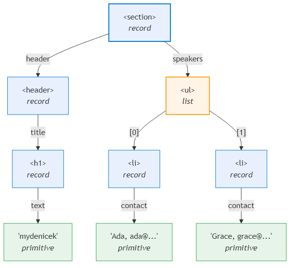
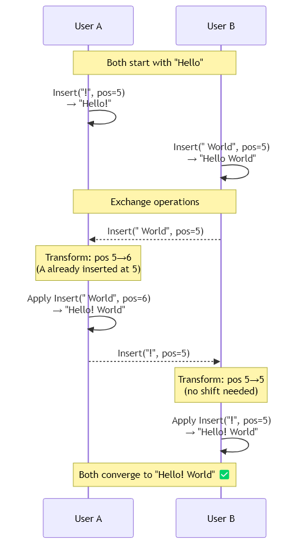
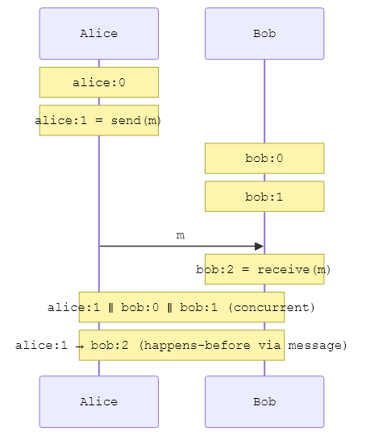

# Background {#chap:background}

This chapter introduces the concepts and systems that form the foundation of this thesis. We describe the Denicek system, explain Operational Transformation, introduce causality and vector clocks, then discuss CRDTs --- focusing on the pure operation-based framework of Baquero et al. that mydenicek adopts.

## Denicek {#sec:denicek}

Denicek [@petricek2025denicek] is a computational substrate for document-oriented end-user programming. It models documents as *tagged trees* --- hierarchical structures where each node carries a structural tag (such as `h1`, `ul`, `tr`) and contains either named fields (records), ordered children (lists), scalar values (primitives), or pointers to other nodes (references). [@Fig:document-tree] shows an example document tree.

{#fig:document-tree width=65%}

The Denicek paper demonstrates the substrate through two systems built on top of it. *Webnicek* is a web-based programming system where documents are rendered as interactive web pages and users program by manipulating the document structure. *Datnicek* is a data science notebook that uses the same substrate for tabular data with formulas, supporting datasets of up to thousands of rows. Both systems share the same edit operations, recording/replay mechanism, and collaboration model --- they differ only in how the document tree is rendered and interpreted.

Nodes are addressed by *selector paths* --- slash-separated strings that describe the location of a node in the tree. For example, `/speakers/0/name` refers to the `name` field of the first item in the `speakers` list. Selectors support wildcards: `/speakers/*` addresses all children of the `speakers` list, enabling bulk operations such as "update the tag of every list item."

Denicek provides four key end-user programming experiences:

- **Programming by demonstration.** Users perform edits interactively --- such as adding a list item and copying a value from an input field --- and the system records these edits as a replayable script. When the user clicks a button, the recorded edits are replayed, potentially on different targets.
- **Schema evolution.** Structural edits allow users to refactor the document's structure without losing data.
- **Collaborative editing.** Multiple peers can edit the same document concurrently, and the system merges their edits deterministically. Notably, Denicek supports wildcard selectors (`speakers/*`) that target all children of a node. When combined with concurrent insertions, this produces a unique semantics: a wildcard edit affects not only items that existed when the edit was made, but also items inserted concurrently by other peers. This *edit-all-including-concurrent-additions* property is discussed further in [@Sec:foreach] and [@Sec:wildcard-concurrent].
- **Formula recomputation.** Nodes can contain formulas that reference other nodes via relative paths. When the referenced data changes, the formula result is recomputed.

### Edit operations

Denicek provides two categories of edit operations. *Data edits* modify the content of the document:

- `add(target, field, value)` --- add a named field to a record
- `delete(target, field)` --- remove a field from a record
- `set(target, value)` --- replace a primitive value
- `insert(target, index, item)` --- insert an item into a list at a given index
- `remove(target, index)` --- remove the item at a given index from a list
- `copy(target, source)` --- copy a subtree from one location to another

*Structural edits* change the shape of the document tree:

- `rename(target, oldField, newField)` --- rename a record field
- `updateTag(target, newTag)` --- change a node's structural tag (e.g., `ul` to `table`)
- `wrapRecord(target, field, tag)` --- wrap a node in a new parent record, moving the original value into a named field
- `wrapList(target, tag)` --- wrap a node in a new parent list
- `reorder(target, fromIndex, toIndex)` --- move a list item from one index to another

The distinction matters for collaborative editing: structural edits change the *paths* by which other edits address nodes. When a peer renames `speakers` to `talks`, all concurrent edits targeting `/speakers/...` must be retargeted to `/talks/...`. When a peer wraps a node, concurrent edits must gain an additional path segment. This is the core challenge that any collaborative editing approach for Denicek must solve.

### Denicek's collaboration model

The original Denicek defines three core operations on edit histories:

1. **Apply** --- apply an edit to a document, producing a new document state and extending the history.
2. **Merge** --- merge two edit histories that diverged from a common ancestor, using OT to transform one history's edits against the other's.
3. **Check for conflicts** --- after merging, identify edits that could not be reconciled (e.g., concurrent deletion and modification of the same node) and report them to the user.

Denicek's histories are *linear sequences* of edits. Merging two linear histories produces a new linear history. Importantly, merge is *not commutative* --- merging history A into B may produce a different result than merging B into A, because the OT transformation order differs. The paper mentions that histories could form a graph rather than a linear sequence, but does not elaborate on this direction.

This thesis takes exactly that step: replacing linear histories with a *causal event graph* (DAG), where merge order does not matter because all peers replay the same deterministic topological order. Under the pure operation-based CRDT framework [@baquero2017pureop], convergence follows directly from the fact that the event set is a G-Set and the *eval* function is deterministic (see [@Sec:crdts]).

## Operational Transformation {#sec:ot}

Operational Transformation (OT), introduced by Ellis and Gibbs [@ellis1989concurrency], transforms concurrent operations so that both peers converge to the same state. [@Fig:ot-text-example] illustrates the basic idea with two concurrent text insertions.

{#fig:ot-text-example width=75%}

Correctness in the decentralized setting requires two *transformation properties* [@ressel1996integrating]: **TP1** (applying $a$ then $T(b,a)$ reaches the same state as $b$ then $T(a,b)$) and **TP2** (transforming a third operation through two concurrent ones is order-independent). Several published algorithms were later proven to violate TP2 [@imine2003proving], and the number of pairwise rules grows with each new edit type. mydenicek sidesteps TP1/TP2 entirely by using a single deterministic replay order ([@Sec:event-dag]).

Sun et al.~[@sun1998achieving] decompose OT correctness into three properties: **convergence**, **causality preservation**, and **intention preservation** (the effect matches the user's intent). TP1/TP2 address convergence; intention preservation depends on the transformation rules and cannot be derived from them. This thesis proves convergence in [@Sec:crdt-framing] and validates intention preservation empirically through the formative examples of [@Sec:formative-examples].

## Causality {#sec:causality}

Lamport's *happens-before* relation [@lamport1978] defines a partial order over events in a distributed system:

> **Definition (happens-before).** $a \to b$ if (1) $a$ and $b$ are from the same peer and $a$ preceded $b$, (2) $a$ is the sending and $b$ the receipt of the same message, or (3) transitivity. Two events are *concurrent* ($a \parallel b$) if neither $a \to b$ nor $b \to a$.

[@Fig:causality] illustrates these relationships in an event graph.

{#fig:causality width=55%}

*Vector clocks* [@mattern1989virtual; @fidge1988timestamps] implement happens-before detection. A vector clock $V$ maps each peer ID to its highest known sequence number. $a \to b$ iff $V_a[p] \leq V_b[p]$ for all $p$ with strict inequality for at least one. This allows concurrency detection in O(P) time.

### Event DAG

Causal relationships form a directed acyclic graph (DAG): each event lists its parents (direct causes). The DAG encodes the full causal structure and enables deterministic replay. The *frontier* --- events with no descendants --- compactly represents the current state. When a peer creates a new event, the current frontier becomes its parents; after sync, a new event merges multiple parents back to a single point, analogous to a merge commit.

## Reliable causal delivery {#sec:causal-delivery}

The pure op-based CRDT framework [@baquero2017pureop] requires two delivery guarantees:

> **Causal consistency.** If operation $a$ is delivered, all operations causally before $a$ have already been delivered.
>
> **Eventual delivery.** Every operation generated by a correct process is eventually delivered to all correct processes.

In mydenicek, causal delivery is implemented by buffering: when a message arrives whose parents have not yet been delivered, it is held until they arrive. Eventual delivery is ensured by frontier-based catch-up: on each sync round, a peer sends its frontier, and the server responds with all missing events. If a message is lost, the frontier does not advance and missing events are resent on the next round.

## Conflict-free Replicated Data Types {#sec:crdts}

CRDTs [@shapiro2011crdt] are data structures designed for distributed systems where multiple replicas can be modified independently and merged without conflicts. The key guarantee is *strong eventual consistency*: any two replicas that have received the same set of updates will be in the same state, regardless of the order in which updates were delivered. Preguiça [@preguica2018crdts] provides a comprehensive overview of CRDTs and their variants.

CRDTs come in two main flavors:

- **State-based CRDTs** (CvRDTs) require the set of possible states to form a *join semilattice* --- a partially ordered set where any two states have a least upper bound (join). Replicas periodically send their full state to each other, and the merge operation computes the join. This works over unreliable channels since states can always be re-merged, but sending the full state can be expensive for large data structures.
- **Operation-based CRDTs** (CmRDTs) propagate individual update operations rather than full states. Concurrent operations must be commutative so that applying them in either order produces the same result. This is more bandwidth-efficient, but requires a reliable causal delivery layer as described in [@Sec:causal-delivery].

A hybrid approach, *delta-state CRDTs*, sends only the part of the state that changed (the "delta") rather than the full state. Deltas are joinable like full states (so they tolerate message loss and reordering) but are small like operations (so they are bandwidth-efficient).

### Pure operation-based CRDTs {#sec:pure-op-crdt}

*Pure operation-based CRDTs* [@baquero2017pureop] are the theoretical foundation of mydenicek. Traditional operation-based CRDTs require concurrent operations to commute pairwise --- hard to design and prove for complex data types. Baquero et al. sidestep this by making the **replica state the set of all delivered operations** (a *PO-Log* --- partially ordered log). The observable value is computed on demand by a deterministic function *eval* over that set.

The framework defines three operations: **prepare** reads the current state and produces a tagged operation; **effect** adds the operation to the PO-Log; **eval** computes the observable value from the PO-Log. The PO-Log is a G-Set (grow-only set) whose merge is set union --- associative, commutative, and idempotent. Shapiro et al. [@shapiro2011crdt] proved that state-based CRDTs with a monotonic join-semilattice merge converge; the G-Set satisfies this trivially. Strong eventual consistency follows from two conditions: (1) every operation is eventually delivered to every replica (*eventual delivery*), and (2) *eval* is deterministic. Condition (1) is a transport-layer concern; condition (2) is the only property the data type designer must prove.

The framework assumes *tagged reliable causal broadcast* [@baquero2017pureop, §3]: each operation is tagged with causal metadata (a vector clock), delivery is causal (if $a \to b$, then $a$ is delivered before $b$), and every operation is eventually delivered. The framework also defines a **redundancy relation** for compaction: once an operation is *causally stable* (delivered to all replicas), it can be pruned from the PO-Log if a more recent operation subsumes it.

mydenicek implements this framework directly. The mapping is:

+--------------------+--------------------------------------------+
| Baquero            | mydenicek                                  |
+====================+============================================+
| PO-Log             | Event DAG (`Map<string, Event>`)           |
+--------------------+--------------------------------------------+
| prepare            | `Denicek.add()`, `.insert()`, etc.         |
+--------------------+--------------------------------------------+
| effect             | `EventGraph.effect()` (= `insertEvent`)   |
+--------------------+--------------------------------------------+
| eval               | `EventGraph.eval()` (= `materialize`)     |
+--------------------+--------------------------------------------+
| Causal broadcast   | WebSocket relay + causal delivery buffer   |
+--------------------+--------------------------------------------+
| PO-Log pruning     | Not implemented (see below)                |
+--------------------+--------------------------------------------+

The event DAG is strictly richer than a PO-Log: it stores explicit parent pointers, enabling checkpoint-based incremental materialization. One deviation from the framework: **the PO-Log cannot be pruned**, because Denicek's programming-by-demonstration mechanism ([@Sec:replay]) references event IDs for replay. Pruning causally stable operations would invalidate replay references. The PO-Log is therefore append-only; the server-side compaction mechanism ([@Sec:compaction-offline]) snapshots the document and discards events only when no replay references point to them.

Common CRDT building blocks relevant to this thesis include:

- **G-Set** (grow-only set): elements can be added but never removed. Merging two G-Sets is simply their union.
- **LWW-Register** (last-writer-wins register): a single value where concurrent writes are resolved by a deterministic ordering (typically by timestamp or logical clock).
- **OR-Set** (observed-remove set): elements can be added and removed. Concurrent add and remove of the same element are resolved in favor of the add.

For collaborative editing of tree-structured documents, Kleppmann and Beresford [@kleppmann2017crdt] proposed a JSON CRDT that uses unique identifiers for each node and supports insert, delete, and move operations. This work identified the *move operation problem*: in a flat JSON structure without native move support, moving a node requires deleting it from one location and inserting it at another --- two separate operations that can interleave with concurrent edits, potentially losing data. For collaborative *rich text* (text with formatting spans and block structure), Peritext [@litt2022peritext] extends character-level CRDTs with mark operations whose semantics tolerate concurrent insertions and deletions within the affected range --- a problem closely related to the "wildcard affects concurrent inserts" behavior we describe in [@Sec:wildcard-concurrent].

## Related systems and why we built our own {#sec:related}

Several existing CRDT libraries were evaluated as potential backends for Denicek.

**Automerge** [@automerge] provides JSON-like data structures (maps, lists, text, counters) with automatic conflict resolution. We represented Denicek's tagged trees as a flat map of nodes with parent-child references. This worked until we encountered the **concurrent wrap problem**: wrapping a node in a new parent requires removing it from the old parent and inserting it into a new one --- two non-atomic Automerge operations. When two peers concurrently wrap the same node, the node ends up referenced from two parents, breaking the tree invariant. The deterministic-ID workaround was fragile and did not scale to nested wraps.

**Loro** [@loro] solved the wrap problem with a native movable-tree CRDT [@kleppmann2021move] where moves are atomic. However, Loro uses opaque node IDs rather than path-based addressing. This caused the **retargeting problem**: Denicek's programming by demonstration relies on replaying recorded edits that create nodes with relative references to their neighbors (e.g., a formula cell referencing `../../0/contact/source` — the sibling cell in the same row). With Loro's opaque IDs, such relative references cannot be expressed — the recorded edit can only reference the specific node ID from the original recording, not the structurally equivalent neighbor in a different row. When the same edit sequence is replayed on a different subtree, the reference points to the wrong node.

**Why not layer path OT on top of Loro?** Layering creates two independent conflict-resolution regimes. Loro resolves concurrent moves by its internal CRDT semantics; a path-OT layer resolves conflicts by rewriting selectors. When they disagree on the same concurrent edit --- which happens precisely in Denicek's core use case of wildcard structural transformations with concurrent inserts --- the path layer retargets selectors to paths that Loro's resolution left empty. This mismatch is systematic, not a corner case. We chose to build a unified system where path-based selectors are the native addressing mode.

**Other systems.** Yjs [@yjs] shares Automerge's limitations for Denicek: no atomic move, no path-based selectors, no native tree CRDT. Eg-walker [@gentle2025egwalker] stores operations in a causal event graph with topological replay --- mydenicek borrows this architectural idea but applies it to trees with selector rewriting, framed as a pure operation-based CRDT rather than an OT/CRDT hybrid. Diamond Types [@diamondtypes] shares the event-graph approach but targets text. json-joy [@jsonjoy] operates on JSON structures but lacks wildcard selectors and structural edits. Grove [@grove2025] targets code editing with commutative operations on fixed-schema ASTs, incompatible with Denicek's schema-free trees. Webstrates [@klokmose2015webstrates] inspired the naming lineage: Webstrates, myWebstrates, Denicek, mydenicek.

Weidner [@weidner2023foreach] identifies the *for-each problem*: operations applied to every element in a range miss concurrently inserted elements. mydenicek's wildcard selectors solve this without a dedicated CRDT for-each operation: wildcards expand at replay time to include all elements that exist at that point, including concurrent insertions ([@Sec:wildcard-concurrent]).

