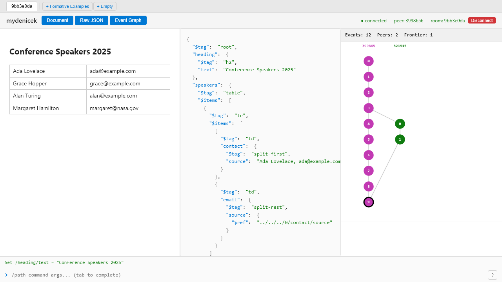

# Implementation {#chap:implementation}

mydenicek is a pure operation-based CRDT for collaborative editing of tagged document trees. The replica state is a grow-only set of edit events; the document is computed by a deterministic *eval* function (`materialize`) that replays events in topological order, transforming edits through concurrent structural changes. [@Fig:data-flow] shows the data flow. The following sections describe the core CRDT design --- the document model, event DAG, materialization algorithm, convergence argument, and edit transformation rules --- followed by implementation details of the complete system.

{#fig:data-flow width=50%}

## Document model {#sec:doc-model}

Documents are modeled as tagged trees with four node types:

- **Record** --- a set of named fields, each containing a child node, plus a structural tag.
- **List** --- an ordered sequence of child nodes with a structural tag.
- **Primitive** --- a scalar value: string, number, or boolean.
- **Reference** --- a pointer to another node via a relative or absolute path.

Reference nodes are unusual in collaborative editing systems. In most CRDT-based systems (Automerge, Loro, json-joy), nodes reference each other via opaque unique IDs --- stable across moves and structural changes, but unable to express relative relationships like "my sibling at index 0." In mydenicek, references are *path-based* (`../0/source`), meaning they navigate the tree relative to their position. This enables patterns like formula nodes referencing sibling data, but requires edit transformation to keep references valid when structural edits (rename, wrap) change the paths they traverse.

Nodes are addressed by *selectors* --- slash-separated paths that describe how to navigate the tree from the root. The selector `speakers/0/name` navigates to the `speakers` field, then to the first list item (index 0), then to the `name` field. Unless stated otherwise, examples in this thesis use selectors *relative to the document root*, without a leading `/`. A leading `/` is only significant in reference nodes (see `Reference` above), where it distinguishes absolute paths from paths relative to the reference's own position. Selectors support three special forms:

- **Wildcards** (`*`): `speakers/*` expands to all children of the `speakers` list. An edit targeting `speakers/*` is applied to every item.
- **Negative indices** (`-1`, `-2`): end-relative list addressing, added in mydenicek. `-1` means the last position (append for insert, last item for remove), `-2` means second-to-last, and so on. Resolved to absolute positions at replay time using a stored `listLength`.
- **Strict indices** (`!0`): `speakers/!0` refers to the item at index 0 *at the time of the edit*, also added in mydenicek. Unlike plain `0`, strict indices are not shifted by concurrent insertions or removals. Their use is described in [@Sec:replay].
- **Parent navigation** (`..`): used in references to navigate up the tree. `../../0/contact` goes up two levels, then navigates to `0/contact`.

Reference nodes (described as the fourth node type above) store their target as a selector path. For example, a reference `"../0/source"` means "navigate up one level from this reference node's position, then down to `0/source`."

[@Tbl:selector-notation] summarizes the selector notation used throughout this thesis.

: Selector notation summary. {#tbl:selector-notation}

| Form | Example | Meaning |
|------|---------|---------|
| Field name | `speakers/0/name` | Navigate by field name or list index |
| Wildcard | `speakers/*` | Expand to all children of the target node |
| Negative index | `insert(items, -1, ...)` | End-relative: `-1` = last position, `-2` = second-to-last |
| Strict index | `speakers/!0` | Not shifted by concurrent inserts/removes; survives recording artifact removal |
| Absolute reference | `/speakers/0` | Starts with `/`; resolved from document root |
| Relative reference | `0/source` | Resolved from the reference node's own position |
| Relative reference to parent | `../0/source` | Navigate up the tree with `..` |

## Event DAG {#sec:event-dag}

The event directed acyclic graph (DAG) is the core data structure of mydenicek. It is a grow-only, append-only structure --- events are immutable once created, and new events can only be added, never modified or removed. This makes the event set a G-Set (grow-only set), one of the simplest CRDTs: two peers that have received the same set of events will always produce the same document. Each edit creates an *event* containing:

- **EventId** --- a unique identifier `peer:seq`, where `peer` is the peer's string identifier and `seq` is a monotonically increasing sequence number. For example, `alice:3` is Alice's third event.
- **Parents** --- the set of event IDs that formed the *frontier* of the creating peer's DAG immediately before this event was appended. Equivalently, they are the most recent events the peer had seen. After the new event is inserted, those parents are no longer on the frontier --- the frontier collapses to this new event alone. An event with multiple parents therefore corresponds to the first edit after a sync that brought in another peer's branch, and is the merge point of the two branches.
- **Edit** --- the actual edit operation (add, delete, rename, set, insert, wrapRecord, etc.) with its target selector and arguments.
- **Vector clock** --- a map from peer ID to the highest sequence number seen from that peer. The vector clock enables causal ordering: event A *happens-before* event B if A's vector clock is dominated by B's. Two events are *concurrent* if neither dominates the other.

Parents and vector clocks serve complementary roles.Parents define the direct edges of the DAG --- they are needed for topological sorting and for the sync protocol's `eventsSince(frontiers)` computation. Vector clocks are an optimization: they enable O(P) concurrency detection (where P is the number of peers) during `resolveAgainst`, which must classify every prior event as either a causal ancestor (skip) or concurrent (transform). Without them, the same information could be computed by traversing the DAG to test reachability, but at greater cost. For example, Alice's event with clock `{alice: 5, bob: 3}` and Bob's event with clock `{alice: 2, bob: 4}` are concurrent because neither clock dominates the other (`alice: 5 > 2` but `bob: 3 < 4`).

## Materialization {#sec:materialization}

To reconstruct the document from the event DAG, we perform *deterministic topological replay*:

1. **Order.** Compute a total order consistent with the causal partial order, using `EventId` lexicographic comparison as tie-breaker for concurrent events.
2. **Resolve and apply.** Starting from the initial document, apply each event's edit in order. Before applying, call `resolveAgainst`, which finds all previously applied *concurrent* edits and transforms the current edit's selector through each of them. Events are stored per peer; since sequence numbers are contiguous, the first concurrent event from peer Y is at position $V_E[Y] + 1$ --- an $O(1)$ lookup. The concurrent events from all peers are then iterated in topological order, transforming the edit through each one.
3. **Conflicts.** If a transformed edit becomes invalid (e.g., it targets a node deleted by a concurrent edit), it becomes a *no-op conflict* --- recorded but not applied. The original event remains in the DAG (events are immutable).

Because the sort order and the selector-rewriting transformations are both deterministic, any two peers that have received the same set of events produce the same document. This is the strong eventual consistency guarantee, stated precisely in [@Sec:crdt-framing].

### Caching

When a new event's parents exactly match the current frontier (the common case during local editing), the event is a *linear extension* of the graph. In that case, `resolveAgainst` is a no-op (every prior is a causal ancestor), so the edit is applied directly to the cached document in $O(S)$ time (where $S$ is the number of nodes matched by the edit's selector) --- no topological sort, no concurrency scan. When another peer's incoming event invalidates the linear cache, the materializer rematerializes from scratch.

### Complexity {#sec:complexity}

The event DAG under the happens-before relation is a **partially ordered set** (poset). Events from the same peer are totally ordered by sequence number, forming a **chain**. Two events are **comparable** (one is an ancestor of the other) or **incomparable** (concurrent). Let $N$ be the total number of events. **We treat the number of peers $P$ as a constant** --- Denicek targets small-group collaboration (typically 2--5 peers), so all $O(P)$ factors reduce to $O(1)$ in the analysis below.

Materialization has two phases:

- **Topological sort.** Kahn's algorithm produces a total order in $O(N + E)$ where $E$ is the number of parent edges. Each event has at most $P$ parents, so $E \leq NP = O(N)$. When multiple events have indegree zero (i.e., they are concurrent), ties are broken by `EventId` comparison using a binary heap. Since each peer's events form a chain, at most $P$ events can have indegree zero at any time, so the heap never exceeds $P$ entries and each operation is $O(1)$. Cost: $O(N)$.

- **Replay.** Each event's edit is applied in order, after transforming it through all incomparable predecessors. Each pairwise transformation is $O(1)$ (fixed dispatch on edit type). Since events are stored per peer in an array indexed by contiguous sequence number, finding the concurrent boundary is $O(1)$ per peer, $O(P) = O(1)$ total. Cost: $O(N + C_\text{total})$, where $C_\text{total}$ is the number of incomparable pairs in the poset --- the total number of pairwise transformations actually performed.

The overall cost is $O(N + C_\text{total})$.

$C_\text{total}$ depends on the DAG shape. For a fully sequential chain, $C_\text{total} = 0$. For a fork into two branches of lengths $a$ and $b$, every event in one branch is incomparable with every event in the other, so $C_\text{total} = a \cdot b$. For an $m$-way fork with branches $a_1, \ldots, a_m$: $C_\text{total} = \sum_{i < j} a_i \cdot a_j$. The benchmarks in [@Sec:performance] confirm these predictions: the local-append benchmark (no concurrency) scales linearly in $N$, while the equal-branch concurrent benchmark scales with $C_\text{total} = (N/2)^2$.

## Convergence {#sec:crdt-framing}

mydenicek is a *pure operation-based CRDT* [@baquero2017pureop] (see [@Sec:pure-op-crdt]). The replica state is a grow-only set (G-Set) of events. The document is produced by `materialize` --- a deterministic function from the event set to the document tree. Convergence follows from two properties:

1. **Agreement on state.** The G-Set guarantees that any two replicas that have communicated (directly or transitively) hold the same event set ([@Sec:sync]).
2. **Deterministic eval.** Given the same event set, `materialize` produces the same document. This holds because each step is deterministic: `topologicalOrder` uses `EventId` comparison (a strict total order), `resolveAgainst` is a sequential walk over the sorted events, and `apply` performs local mutations with no randomness.

Together, these give **strong eventual consistency**: any two replicas that have received the same set of events are in the same state.

Convergence is the easy part. The hard part is **intention preservation** --- ensuring that the *result* of merging concurrent edits matches what users intended. References must survive structural edits, wildcards must expand over concurrent inserts, indices must shift through concurrent modifications, and recorded edits must replay after schema evolution. Convergence is guaranteed by the framework; intention preservation is validated empirically through the formative examples ([@Sec:formative-examples]) and property-based tests ([@Sec:property-tests]).

## Edit types {#sec:edit-types}

The system supports 11 edit types: record operations (`RecordAdd`, `RecordDelete`, `RecordRename`), list operations (`ListInsert`, `ListRemove`, `ListReorder`), structural operations (`UpdateTag`, `WrapRecord`, `WrapList`), `CopyEdit` (subtree copy with mirroring), and `ApplyPrimitiveEdit` (extensible custom edits). Three inverse types (`UnwrapRecord`, `UnwrapList`, `RestoreSnapshot`) are produced only by `computeInverse()` for undo.

### Selector rewriting {#sec:selector-rules}

When two edits are concurrent, the later one's selector must be rewritten through the earlier one's structural effect. [@Tbl:selector-rules] summarizes the rules.

: Selector rewriting rules. {#tbl:selector-rules}

+--------------------+------------------------------------------+----------------------------------------------+
| Edit               | Rule                                     | Example                                      |
+====================+==========================================+==============================================+
| Rename a to b      | a/… becomes b/…                          | speakers/0/name becomes talks/0/name         |
+--------------------+------------------------------------------+----------------------------------------------+
| WrapRecord(f)      | a/… becomes a/f/…                        | x/value becomes x/inner/value                |
+--------------------+------------------------------------------+----------------------------------------------+
| WrapList           | a/… becomes a/\*/…                       | x/data becomes x/\*/data                     |
+--------------------+------------------------------------------+----------------------------------------------+
| Delete             | a/… removed                              | concurrent edit becomes no-op                |
+--------------------+------------------------------------------+----------------------------------------------+
| Insert at i        | indices $\geq$ i shift +1                | items/3 becomes items/4                      |
+--------------------+------------------------------------------+----------------------------------------------+
| Remove at i        | index i removed; indices $>$ i shift −1  | items/3 becomes items/2                      |
+--------------------+------------------------------------------+----------------------------------------------+
| Reorder(f, t)      | f becomes t; range shifts                | items/1 becomes items/3                      |
+--------------------+------------------------------------------+----------------------------------------------+

Transformations compose sequentially: if Alice renames `speakers` -> `talks` and Bob wraps each item in a `<tr>` record, then Carol's selector `speakers/0/name` becomes `talks/0/name` (through rename), then `talks/0/value/name` (through wrap).

Concurrent conflicts are resolved deterministically: concurrent renames compose (both apply in replay order), concurrent wraps produce double nesting, concurrent list inserts and removes shift through each other, and double removes produce a no-op conflict.

### Edit transformation dispatch {#sec:ot-architecture}

A naive implementation requires $n^2$ pairwise rules for $n$ edit types. mydenicek avoids this with two virtual methods in the `Edit` base class ([@Fig:edit-class-diagram]):

- **`transformSelector(sel)`** rewrites a selector through this edit's structural effect. Non-structural edits return the selector unchanged.
- **`transformLaterConcurrentEdit(concurrent)`** returns a transformed version of a concurrent edit. The default delegates to `transformSelector`, handling most edit pairs.

This gives $n$ methods instead of $n^2$: each edit type implements `transformSelector` once, and it works for all concurrent edit types.

{#fig:edit-class-diagram width=75%}

Two cases require more than selector rewriting:

- **Payload rewriting.** A structural wildcard edit concurrent with a list insert must modify the *inserted node*, not just the insert's selector. Structural edits call `concurrent.rewriteInsertedNode(target, rewriteFn)` --- a virtual method overridden by `ListInsertEdit` to apply the rewrite to its payload.
- **Index shifting.** List edits that shift indices call a virtual method on the concurrent edit, passing the target, threshold, and delta. Each list edit type shifts its own indices. This replaces $3 \times 3 = 9$ pairwise rules with three single-method overrides.

### CopyEdit and mirroring {#sec:copy-edit}

`CopyEdit` has two selectors --- `target` and `source`. When a concurrent edit modifies the source, the same modification is replicated onto the copy target by wrapping the concurrent edit in a `CompositeEdit` that applies to both locations.

This differs from payload rewriting ([@Sec:ot-architecture]): payload rewriting changes *what gets inserted*, mirroring duplicates *where an edit applies*.

### Wildcard edits and concurrent insertions {#sec:wildcard-concurrent}

Wildcard edits (e.g., `updateTag("speakers/*", "tr")`) affect concurrently inserted items --- a deliberate design choice matching the original Denicek semantics, not a consequence of convergence ([@Fig:wildcard-diamond]).

{#fig:wildcard-diamond width=55%}

The mechanism depends on replay order: if the insert replays first, the wildcard naturally expands to include it; if the wildcard replays first, the insert's payload is rewritten to match. Both orders produce the same result. This is uncommon in CRDTs --- most systems only affect items that existed when the operation was created. Weidner [@weidner2023foreach] calls this the *for-each* problem. In mydenicek, wildcards are expanded at replay time, not creation time, so the for-each semantics follows naturally.

## Implementation details {#sec:impl-details}

The implementation is a Deno/TypeScript[^deno] monorepo published on JSR[^jsr], organized in three packages ([@Fig:architecture]): `@mydenicek/core` (the CRDT engine --- pure TypeScript, single runtime dependency), `@mydenicek/react` (React bindings), and `@mydenicek/sync` (WebSocket relay). Two applications use them: a web frontend (`apps/mywebnicek`) and a deployed sync server (`apps/sync-server`). The core has no knowledge of the transport layer; the server has no knowledge of edit types.

[^deno]: Deno (<https://deno.com>) is a TypeScript/JavaScript runtime with built-in tooling (formatter, linter, test runner, type checker).
[^jsr]: JSR (<https://jsr.io>) is a TypeScript-first package registry with Sigstore provenance attestation.

{#fig:architecture width=70%}

[@Tbl:loc] shows the size of each component. The API documentation is published at <https://jsr.io/@mydenicek/core/doc>.

: Lines of TypeScript (non-empty, non-comment). {#tbl:loc}

| Component | Source | Tests |
|---|---:|---:|
| `@mydenicek/core` (CRDT engine) | 5,770 | 6,898 |
| `@mydenicek/sync` (WebSocket relay) | 1,050 | 673 |
| `@mydenicek/react` (React bindings) | 364 | --- |
| Web application | 2,775 | --- |
| Sync server | 558 | --- |
| **Total** | **10,517** | **7,571** |

### Extensibility {#sec:extensibility}

The core engine is extended via two registries:

- **Primitive edits.** Applications register custom transformations on primitive values via `registerPrimitiveEdit(name, fn)` --- for example, `splitFirst` and `splitRest` for the conference table.
- **Formula operations.** Custom formula evaluators are registered via `registerFormulaOperation` and `registerTagEvaluator`.

Both are stored by name in the event DAG and replayed on all peers. The sync server does not need to know about them.

### Serialization {#sec:serialization}

For wire transport and persistence, events are serialized as JSON using a codec layer. Each `Edit` subclass implements `encodeRemoteEdit()` to produce its serialized form. Decoding uses a registry: each edit type registers a decoder function keyed by its `kind` string, avoiding a central switch statement.

### Formula engine {#sec:formulas}

Denicek's document model includes formula nodes --- records whose values are computed from other parts of the document rather than stored directly. mydenicek supports two kinds of formulas: **tag-based** (a `RecordNode` with a specific tag, e.g., `split-first`) and **operation-based** (a `RecordNode` with tag `x-formula` and an `operation` field). References in formula arguments are resolved transparently; circular references are detected by a visited-set check.

### Undo and redo {#sec:undo}

Each `Edit` implements `computeInverse(preDoc)` returning the inverse edit (e.g., `RecordAddEdit` -> `RecordDeleteEdit`). Undo creates a new event containing the inverse, computed against the document state at the original event's parent frontier. This event syncs to all peers like any other edit.

### Recording and replay {#sec:replay}

Programming by demonstration stores event IDs as replay steps (typically in a button node). On replay, the system captures the source event's edit and transforms its selector through every later edit in the topological order --- the same edit transformation pipeline used for concurrent resolution. The replayed edit behaves as if performed concurrently with all events since recording: the transformations retarget it through every structural change. Strict indices (`!0`) pin a selector to a fixed position so it is not shifted by later list insertions or removals.

### Sync and server {#sec:sync}

Convergence requires only that all peers eventually receive the same event set. mydenicek uses a centralized WebSocket relay server ([@Fig:sync-protocol]). The server organizes collaboration into *rooms* --- each room holds the initial document, the event DAG, and the set of connected peers. Both sides exchange **sync** messages containing their current frontiers and any events the other side is missing.

{#fig:sync-protocol width=80%}

The server operates in **relay mode**: it stores and forwards events without materializing the event graph into a document. Events are persisted to append-only NDJSON files. Reliability is achieved through frontier-based catch-up: dropped connections are recovered by resending missing events on reconnection. Remote events are accepted without edit validation — each peer validates locally before sending. The system assumes a trusted peer set and does not defend against Byzantine faults.

### Web application {#sec:webapp}

The web application (`apps/mywebnicek`) is a single-page React application. The interface provides three panels ([@Fig:webapp-ui]): rendered HTML, raw JSON, and an event DAG visualization. A command bar executes edits via `/selector command args` syntax.

{#fig:webapp-ui width=95%}

The source code is at <https://github.com/krsion/mydenicek> and the live demo at <https://krsion.github.io/mydenicek>.
