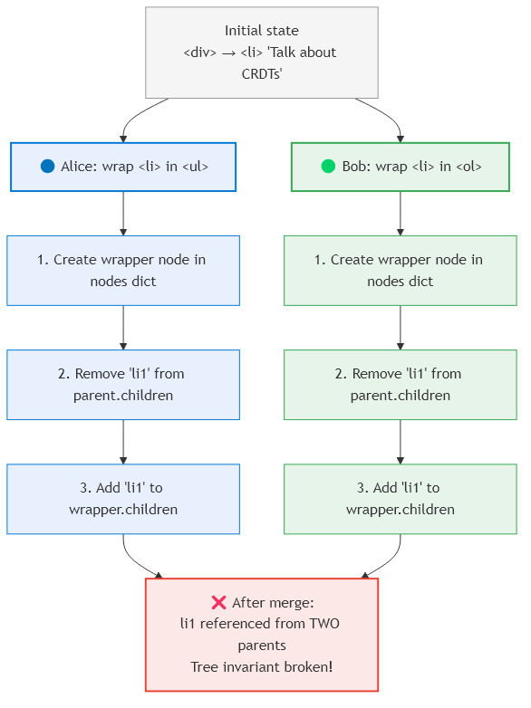
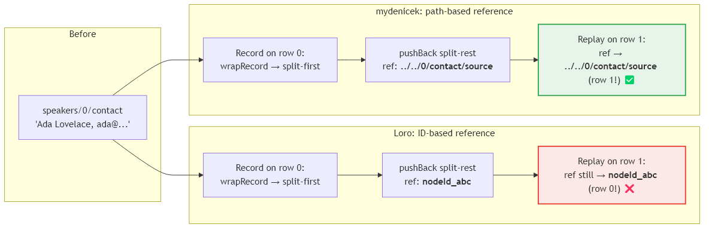

# Journey: Automerge, Loro, Custom {#chap:journey}

This chapter describes the iterative process of finding the right collaborative editing approach for Denicek. We considered Grove, tried Automerge, moved to Loro when we discovered fundamental limitations with move operations, and ultimately built a custom OT-based event DAG when Loro's opaque ID system proved incompatible with Denicek's path-based programming model. Each transition was motivated by concrete problems discovered during implementation.

## Why not Grove? {#sec:grove}

Grove [@grove2025] is a calculus for collaborative structure editing that models all edits as commutative operations on abstract syntax trees. It was the first system we considered, since it directly addresses concurrent editing of tree structures --- the same problem Denicek faces.

However, Grove is designed for collaborative *code editing*, where the tree is an abstract syntax tree with a fixed schema defined by a grammar. Denicek's document trees are *schema-free*: users can add arbitrary fields, change tags, and restructure the tree at will. Grove's commutativity relies on the tree conforming to a known grammar, which Denicek does not have. Additionally, Grove was published as a formal calculus without an implementation library that could be integrated into a TypeScript project. For these reasons, we turned to general-purpose CRDT libraries that support arbitrary JSON-like structures.

## Attempt 1: Automerge {#sec:automerge}

Automerge [@automerge] is a widely-used CRDT library developed by Ink & Switch, a research lab where Martin Kleppmann is a key contributor. It provides JSON-like data structures --- maps, lists, text, and counters --- with automatic conflict resolution. It was the natural first choice: the Ink & Switch team has authored many of the foundational papers on local-first software and CRDTs that this thesis builds upon.

Automerge's API is designed so that developers do not need to understand CRDTs. The programmer simply edits a JSON-like document through a `change()` callback, and Automerge handles conflict resolution, history tracking, and synchronization internally. With the `automerge-repo`\footnote{\url{https://github.com/automerge/automerge-repo}} and `@automerge/automerge-react`\footnote{\url{https://www.npmjs.com/package/@automerge/automerge-react}} packages, syncing a document between peers requires just a few lines of code --- the React hook re-renders automatically when remote changes arrive. This low barrier to entry made Automerge an attractive starting point --- it is designed for developers who want collaborative editing without investing deeply in CRDT theory.

### Internal representation

To represent Denicek's tagged document trees in Automerge, we used a *flat map* architecture. Each node was stored as an entry in a dictionary (`Record<string, Node>`), identified by a unique string ID. Parent-child relationships were stored separately as `children` arrays containing child IDs:

```json
{
  "root": "n1",
  "nodes": {
    "n1": { "kind": "element", "tag": "div",
            "children": ["n2", "n3"] },
    "n2": { "kind": "element", "tag": "ul",
            "children": [] },
    "n3": { "kind": "value", "value": "Hello" }
  }
}
```

This flat map design was chosen because Automerge does not support native tree structures with move operations. We considered alternative representations --- for instance, nesting Automerge objects directly to mirror the tree hierarchy --- but any representation that requires moving a subtree from one parent to another ultimately needs two non-atomic Automerge operations (remove from old parent, insert into new), which is the root of the concurrent wrap problem described next. A node's data (tag, attributes, value) lives in the `nodes` dictionary, while the ordering of children lives in the parent's `children` array. To "move" a node --- for example, to wrap it in a new parent --- we had to remove the node's ID from one `children` array and insert it into another. These are two separate Automerge operations, not an atomic move.

### The concurrent wrap problem {#sec:concurrent-wrap}

The lack of atomic move operations led to a fundamental problem with the *wrap* edit. Wrapping is one of Denicek's core structural operations: it creates a new parent element and moves an existing node into it. In the flat map representation, wrapping a node `li1` in a new `ul` element requires three steps:

1. Create a new node `wrapper` in the `nodes` dictionary with tag `ul`
2. Remove `"li1"` from the original parent's `children` array
3. Add `"li1"` to `wrapper`'s `children` array

When two peers concurrently wrap the same node, both execute these three steps independently, as shown in [@Fig:concurrent-wrap]. After merging:

{#fig:concurrent-wrap width=85%}

- Both peers created a wrapper node. We used a deterministic ID scheme (`wrapper-${wrappedNodeId}`) so that both peers create the "same" wrapper, and Automerge's LWW resolution picks one tag.
- Both peers removed `"li1"` from the original parent --- this converges correctly.
- Both peers added `"li1"` to the wrapper's `children` --- but if the wrappers are different (because the deterministic ID scheme failed, or the wraps target different parent types), the node ends up referenced from *two parents*, breaking the tree invariant that each node has exactly one parent.

The deterministic ID workaround was fragile: it did not scale to nested wraps, and any mismatch in the wrapper creation logic would produce an inconsistent tree. Automatic cleanup of duplicate parent references is not possible either --- a node appearing in two `children` arrays is *observationally indistinguishable* from an intentional structure where the user added the same reference to two lists. Any cleanup algorithm would risk deleting legitimate user data.

These problems motivated the move to Loro, which provides a native movable tree CRDT.

## Attempt 2: Loro {#sec:loro}

Loro [@loro] is a newer CRDT library that implements the latest research in collaborative data structures, including a *movable tree CRDT* [@kleppmann2021move] that supports atomic move operations and the *Fugue* algorithm [@weidner2023fugue] for text editing. It solved the concurrent wrap problem completely: moving a node from one parent to another is a single atomic operation, and concurrent moves are resolved deterministically.

### Advantages

Loro addressed the three main problems we had with Automerge:

- **Atomic move.** `LoroTree` supports native move operations, solving the concurrent wrap problem from Automerge. Concurrent moves to different parents are resolved by Last-Writer-Wins, and the node always ends up under exactly one parent.
- **Rich data model.** Loro provides a movable tree [@kleppmann2021move], rich text (Fugue algorithm [@weidner2023fugue]), maps, and lists --- all with well-defined concurrent semantics.
- **Good developer experience.** Well-documented API with TypeScript bindings.

### The retargeting problem {#sec:retargeting}

Despite solving the structural issues, Loro proved incompatible with Denicek's *programming by demonstration* model. The core problem is replaying edits that *create* nodes containing relative references.

In Denicek, users record edits and replay them. A recorded edit might say: "push a new item to the speakers list, then copy the value from the input field into the new item." The copy operation creates a node with a *relative reference* --- it refers to `../input/value`, meaning "the input field that is a sibling of the list I just pushed to."

Loro uses *opaque* node IDs --- unique identifiers (such as `nodeId_abc123`) that have no relationship to a node's position in the tree. When replaying the creation of a reference node, the recorded ID points to the specific node that existed at recording time. This works for simple replay, but breaks when the edit sequence is replayed in a different context --- the reference node must be created with a path that resolves relative to its *new* position, not the original one.

Consider the conference table example from [@Chap:formative]. Alice records a sequence of edits on the first row of a speakers table:

1. `wrapRecord /speakers/0/contact` --- wraps the contact string in a `split-first` formula node
2. `pushBack /speakers/0` --- adds a second table cell with a `split-rest` formula that references `../../0/contact/source`

The `split-rest` formula uses a relative path (`../../0/contact/source`) to navigate from the second cell back to the first cell's wrapped contact value. When this edit sequence is replayed on a different row, the relative path still navigates correctly --- it always points to the first cell of *the current row*.

With Loro's opaque IDs, the reference would point to `nodeId_abc123` --- the specific node from row 0. Replaying on row 1 would still reference row 0's data, producing incorrect results. Even worse, after the `wrapRecord` operation, the original contact value moved one level deeper in the tree (it became the `source` field of the formula node). Loro's ID still points to the formula node, not to the `source` child where the actual value now lives.

This is not a bug in Loro --- it is a fundamental mismatch between ID-based and path-based addressing, illustrated in [@Fig:retargeting]. Denicek's programming model requires paths that can be *retargeted* through structural changes, and Loro's design does not support this.

{#fig:retargeting width=90%}

### Why not add path OT on top of Loro? {#sec:why-not-layer}

A natural question is: why not keep Loro for the CRDT layer and add a path transformation layer on top? We considered this approach but rejected it because it creates *two independent conflict-resolution regimes* that can disagree on the same concurrent history.

Loro resolves structural conflicts with its internal CRDT semantics: map keys are LWW, and the movable-tree CRDT resolves concurrent moves by a total order on operations. A path-OT layer resolves conflicts by rewriting selectors as concurrent edits are applied. Whenever the two regimes are asked about the same pair of concurrent structural edits, they may pick different winners --- and because the upper layer sees only Loro's post-resolution tree, it cannot recover from the mismatch.

A concrete example. Consider a record $R$ with one field `name` holding a text node. Alice renames the field `name` → `fullName`, and Bob concurrently moves the subtree at `R/name` into a new container `R2/name`. Alice's event is implemented in the layered design as a Loro `map.delete("name") + map.set("fullName", ...)` pair; Bob's is a Loro movable-tree move from `R/name` to `R2/name`. Loro's movable-tree CRDT resolves the concurrent move-versus-delete by a deterministic total order: suppose Bob wins, so the subtree ends up at `R2/name` and `R/name` no longer exists.

The path-OT layer, running against the same event DAG, tries to keep Alice's rename consistent with edits that target `R/name` by transforming any concurrent selector `R/name/...` into `R/fullName/...`. A concurrent edit by Carol targeting `R/name/value` is therefore retargeted to `R/fullName/value` by the path layer --- but in the Loro state, there is no `R/fullName`; the subtree lives under `R2/name`. The path layer has retargeted Carol's edit to a path that Loro's resolution left empty, and Loro has left the subtree under a path the path layer does not know about. There is no way for the path layer to learn about Bob's winning move without re-implementing Loro's movable-tree algorithm, and there is no way to undo Loro's move without giving up the very CRDT guarantees the layering was supposed to inherit. The two layers have produced inconsistent views of the same concurrent edit, and the user sees Carol's edit apparently vanish.

This is not a one-off interaction: any edit that a path-OT layer would rewrite through a structural change that Loro also resolves --- renames, moves, wraps, deletes --- is a potential source of the same class of disagreement. While this pathological scenario requires three-way concurrency on overlapping paths, it arises precisely in Denicek's core use case: structural transformations (rename, wrap) applied via wildcards interact with concurrent insertions and edits by other peers, producing exactly the multi-party overlapping-path concurrency that triggers the mismatch. A hybrid design could fall back to conflict markers in such cases, but that would mean the most interesting collaborative scenarios --- the ones that motivate the thesis --- would produce unresolved conflicts rather than merged documents. Instead, we chose to build a single coherent system where path-based selectors are the native addressing mode and the conflict-resolution step operates directly on them. This eliminates the translation layer and gives us full control over conflict-resolution semantics.

## The custom approach {#sec:custom}

Inspired by Eg-walker [@gentle2025egwalker] but framed as a *pure operation-based CRDT* [@baquero2017pureop] rather than an OT/CRDT hybrid, we built a custom event-graph design that combines the robustness of CRDTs (peer-to-peer sync without a central server) with the simplicity of OT-style selector rewriting (path-based addressing, no per-node metadata).

The key design decisions are:

- **Event graph as CRDT state.** All edits are stored as immutable events in a DAG, and the replica state is the set of received events --- a grow-only set (G-Set), which is itself a canonical CRDT whose merge is union. Two peers that have received the same event set therefore have the same state.
- **Document as a deterministic pure view function.** To observe the document, events are sorted in a canonical topological order (Kahn's algorithm with `EventId` tie-breaking) and replayed against the initial document. During replay each edit's selector (and, for structural edits, its payload) is rewritten against previously materialized concurrent edits. Because the view function is deterministic, same event set implies same document; this gives strong eventual consistency without requiring operations to commute, and without the OT transformation properties TP1/TP2.
- **Path-based selectors.** All operations use slash-separated selector paths, matching Denicek's native addressing. Wildcards, relative paths, and strict indices are first-class.
- **Minimal runtime dependencies.** The core engine is pure TypeScript with a single small runtime import — `@std/data-structures/binary-heap` from the Deno standard library, used for the Kahn priority queue. There is no WASM, no native bindings, and no framework coupling, making the package portable across Deno, Node.js, and browser environments.

The following chapter describes the implementation in detail.
