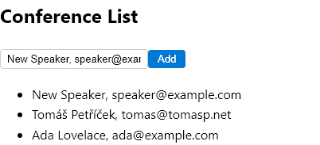
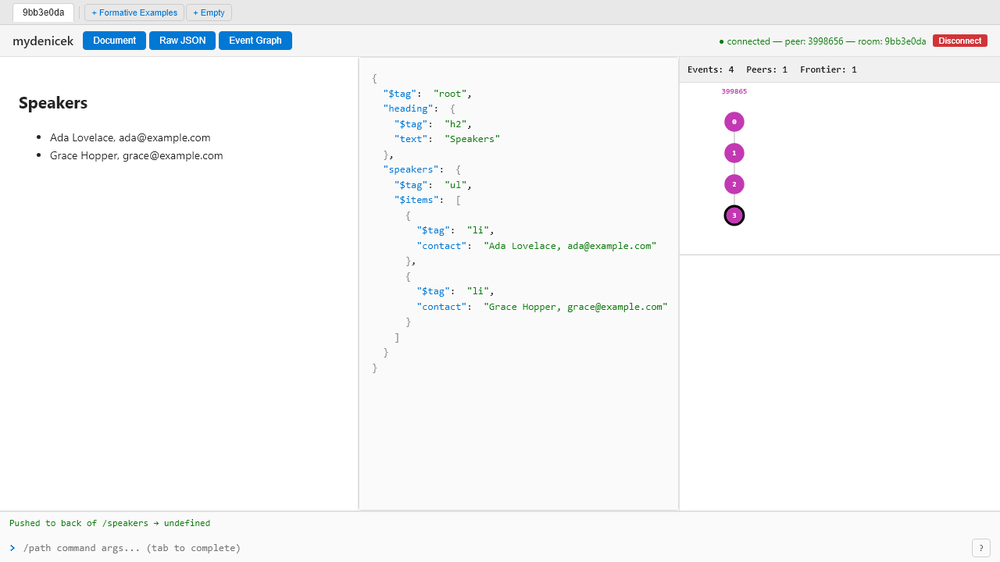
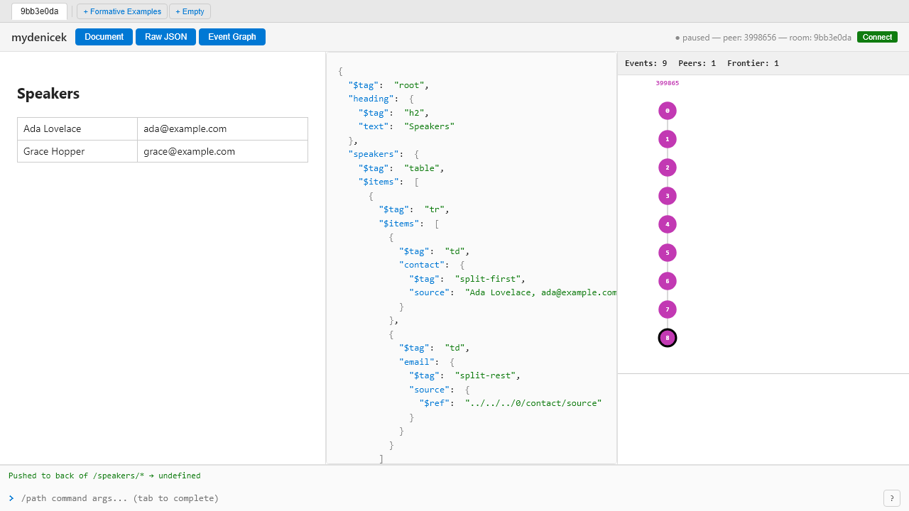
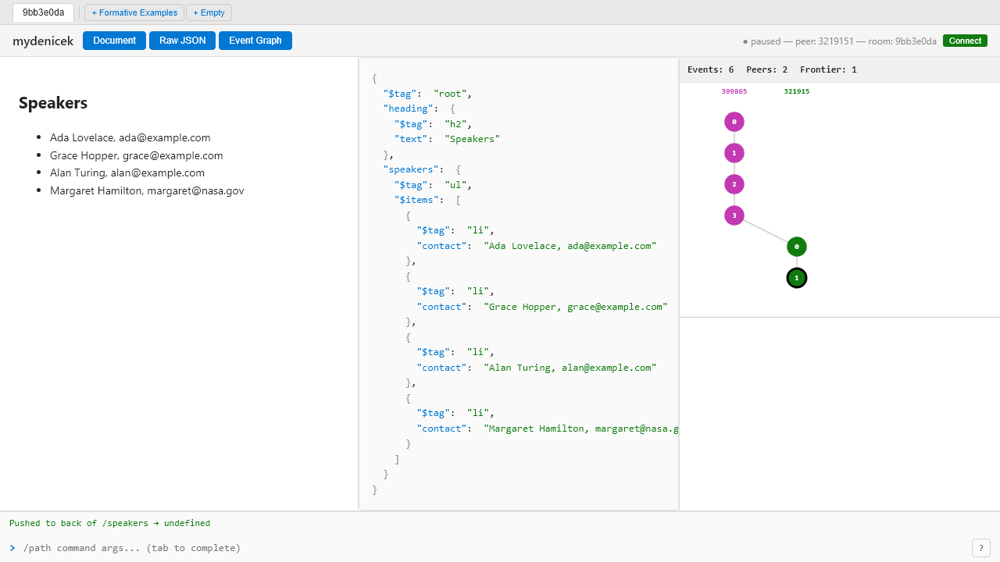
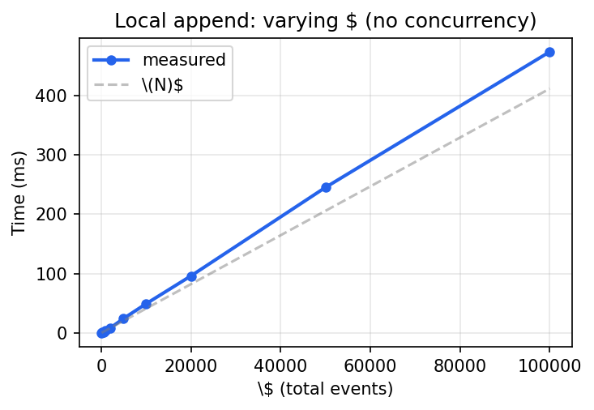
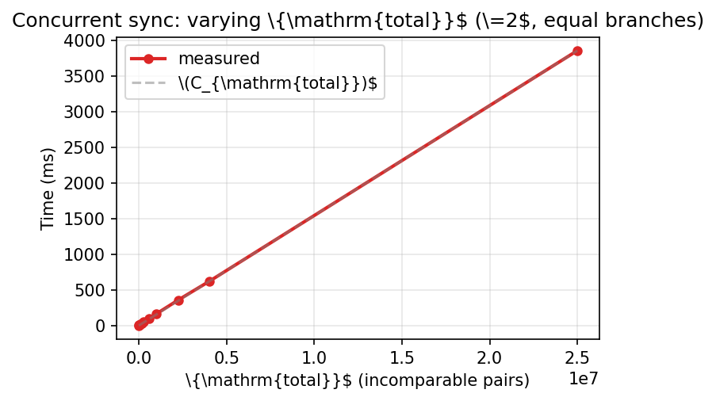

# Evaluation {#chap:evaluation}

This chapter evaluates the mydenicek CRDT along three axes: *does it meet Denicek's requirements* (approach comparison), *does it produce correct results* (formative examples, testing, property-based tests), and *is it fast enough* (performance). We begin with the approach comparison that motivated the custom design, then demonstrate correctness through formative examples that exercise the key features, and conclude with quantitative evaluation.

## Approach comparison {#sec:comparison}

[@Tbl:approach-comparison] summarizes the three approaches evaluated in this thesis against Denicek's key requirements.

: Comparison of the three approaches against Denicek's requirements. {#tbl:approach-comparison}

| Requirement | Automerge | Loro | mydenicek (custom) |
|---|---|---|---|
| Atomic move/wrap | No (two-step) | Yes (movable tree) | Yes (selector rewriting) |
| Path-based addressing | No (opaque IDs) | No (opaque IDs) | Yes (native) |
| Wildcard selectors | No | No | Yes |
| Relative references | No | No | Yes (path-based) |
| Replay retargeting | No | No (ID-based) | Yes (selector rewriting) |
| For-each semantics | No | No | Yes (wildcard expansion) |
| Character-level text | Yes | Yes (Fugue) | No (LWW) |

Automerge and Loro excel at general-purpose collaborative JSON editing but lack the path-based features Denicek requires. The custom approach sacrifices character-level text editing but gains native support for all of Denicek's programming-by-demonstration features. The original Denicek uses a Git-like model where peers work on local branches and merge manually; mydenicek replaces this with automatic merge via deterministic replay.

## Formative examples {#sec:formative-examples}

The following examples demonstrate that mydenicek meets each requirement from [@Tbl:approach-comparison]. Each example is implemented as a test that constructs documents, applies edits, syncs between peers, and asserts the expected result.

### Hello World: custom primitive edits and replay {#sec:hello-world}

The first example demonstrates *custom primitive edits* and *wildcard replay*.

```
registerPrimitiveEdit("capitalize", value -> titleCase(value))

e = recordedPeer.applyPrimitiveEdit("messages/0", "capitalize")
sync(recordedPeer, replayPeer)
replayPeer.replay(e, "messages/*")
```

```
Before:  messages = ["hello WORLD", "fOO bar"]
After:   messages = ["Hello World", "Foo Bar"]
```

The CRDT is extensible --- users register domain-specific transformations that participate in the event DAG and can be replayed with wildcards.

### Counter: formulas and programming by demonstration {#sec:counter}

The Counter example demonstrates the *formula engine* and *recording/replay* (programming by demonstration). [@Fig:formative-counter] shows the counter after one increment.

{#fig:formative-counter width=40%}

The document starts with `counter/value = 0`. Three recorded edits implement "increment": wrap the value into a `plus(_, 1)` formula node, rename the inner field, and add the right operand:

```
e1 = wrapRecord("counter/value", field="value", tag="plus")
e2 = rename("counter/value", "value" -> "left")
e3 = add("counter/value", "right", 1)
button.steps = [e1, e2, e3]
```

```
Before:  counter = 0
After:   counter = plus(0, 1) -> 1
Replay:  counter = plus(plus(0, 1), 1) -> 2
```

Each replay re-executes all three recorded edits (wrap, rename, add). Their selectors are internally transformed through all prior structural edits to match the original value's new location inside the nested wrappers. The formula engine evaluates the nested structure recursively.

### Conference List: adding items with recorded edits {#sec:conf-list}

The conference list demonstrates recorded edits with an input field and a button. [@Fig:formative-conf-list] shows the rendered list.

{#fig:formative-conf-list width=40%}

Two edits are recorded: insert a new empty item, then copy the input field value into it. The copy uses a strict index (`!0`) so that during replay, `resolveAgainst` does not shift it to the item that was added by the first recorded insert:

```
e1 = insert("items", index=0, value=<li text="">)
e2 = copy("items/!0/text", from="input/value")
button.steps = [e1, e2]
```

```
-- items is ["Ada"]
set("input/value", "Grace")
replay(button)
-- items is now ["Grace", "Ada"]
```

### Conference Table: structural transformation {#sec:conf-table}

The conference table is the most complex example. It demonstrates *schema evolution* --- refactoring a flat list into a structured table. [@Fig:formative-conf-table] shows the final result.

{#fig:formative-conf-table width=40%}

Five structural edits transform the list. The wildcard `*` ensures every row is transformed simultaneously:

```
updateTag("speakers", "table")      -- list -> table
updateTag("speakers/*", "td")       -- items -> cells
wrapList("speakers/*")              -- cells -> rows
wrapRecord("speakers/*/0/contact",  -- split-first
    field="source", tag="split-first")
insert("speakers/*", index=-1,      -- email column
    value=<td split-rest(ref(sibling))>)
```

```
Before:  <ul>  <li> "Ada, ada@..." </li>
               <li> "Grace, grace@..." </li>  </ul>

After:   <table>  <tr> <td> "Ada" </td>
                       <td> "ada@..." </td> </tr>
                  <tr> <td> "Grace" </td>
                       <td> "grace@..." </td> </tr>  </table>
```

All edits are recorded as events in the DAG. Importantly, the "Add Speaker" button recorded in the list phase continues to work after the refactoring --- see [@Sec:replay-after-refactor].

### Conference Table: concurrent editing {#sec:conf-concurrent}

Two peers start from the same conference list, disconnect, and make concurrent edits: **Alice** refactors the list into a table (as above), while **Bob** adds two new speakers via `insert`. When they reconnect and sync, Alice's wildcard edits automatically expand to include Bob's concurrently inserted items: `updateTag` changes their tags, `wrapList` wraps them in `<tr>` lists, and `insert` adds the split formula cells. The result is a table with all four speakers --- each with correctly split name and email columns --- even though Bob inserted plain `<li>` items into a `<ul>` list. This *wildcard-affects-concurrent-insertions* property ([@Sec:wildcard-concurrent]) is a direct consequence of the replay-based edit transformation approach.

[@Fig:concurrent-initial;@Fig:concurrent-alice;@Fig:concurrent-bob;@Fig:concurrent-merged] show the four stages of this process.

{#fig:concurrent-initial width=95%}

{#fig:concurrent-alice width=95%}

{#fig:concurrent-bob width=95%}

{#fig:concurrent-merged width=95%}

### Button replay after schema evolution {#sec:replay-after-refactor}

Recorded edit sequences survive structural refactoring. The "Add Speaker" button was recorded against a flat `<ul>` list --- its steps insert a `<li>` item and copy the input value. After Alice refactors the list into a `<table>` with formula columns, clicking the button still works: each recorded step is retargeted through all structural edits that happened after recording. The replayed insert produces a complete table row with split-first and split-rest cells, as if recorded against the table.

Replay reuses the same selector rewriting rules as concurrent editing. The system finds the recorded edit in the topological order, transforms it forward through every later edit that could affect it (structural edits and wildcard-targeting edits), and commits the adjusted edit as a new event at the current frontier.


## Testing strategy {#sec:testing}

Testing distributed systems is fundamentally harder than testing sequential programs: bugs arise from specific interleavings of concurrent events, message orderings, and failure patterns that are difficult to reproduce [@ozkan2025modelfuzz]. mydenicek addresses this through a layered testing strategy, organized as a testing pyramid:

- **Unit tests** (over 280 cases) test individual edit types in isolation: does a rename produce the expected document? Does an insert land at the correct index? Does a structural edit's `transformSelector` rewrite a given path correctly?
- **Integration tests** (over 40 cases) test edit *interactions*: two concurrent edits on a shared document, the full `resolveAgainst` pipeline on a small DAG, reference rewriting through structural changes, and undo/redo across peers. A dedicated *concurrent pair matrix* (`concurrent-pair-matrix.test.ts`) systematically tests one scenario per non-trivial edit-type pair — 21 pairs covering all combinations where `transformSelector` or payload rewriting produces a non-identity result (e.g., rename+insert, wrapRecord+insert, copy+edit-on-source, updateTag+rename). Each test verifies both convergence and intention preservation.
- **Property-based tests** using `fast-check` (described in [@Sec:property-tests]) randomize across all layers: they generate random edit sequences, random sync orderings, and assert convergence and intention preservation invariants. This is the highest-value layer — it exercises scenarios that hand-written tests would never cover.
- **Formative example tests** (6 cases) simulate realistic multi-peer workflows: recording, replay, formula evaluation, schema evolution, and button replay after refactoring.
- **Sync end-to-end tests** (21 cases) cover the WebSocket relay: synchronization, late join, concurrent edits, reconnection, and offline convergence.
- **Browser end-to-end tests** (Playwright) verify that two browser peers can sync edits via the deployed server, closing the loop from UI to transport to CRDT and back. These run separately from the 358-test unit suite.
- **Continuous integration** via GitHub Actions runs all layers on every push.

In total, the test suite has 358 tests (337 in the core package, 21 in the sync package) comprising approximately 7,600 lines of test code --- more than the 5,800 lines of the CRDT core itself. Deno's built-in coverage tool reports **90% branch coverage** (fraction of decision branches --- if/else, switch cases --- taken by at least one test) **and 81% line coverage** (fraction of source lines executed) across the CRDT core. The remaining gaps are concentrated in defensive error-throwing branches and undo-specific inverse operations. The sync package achieves 95% branch coverage on the room logic; the WebSocket transport layers are covered by Playwright browser end-to-end tests rather than unit tests.

## Property-based tests {#sec:property-tests}

The file `tests/core-properties.test.ts` uses the `fast-check` library to randomize edit sequences, sync operations, and delivery orders, then asserts invariants on the resulting document states. This approach is a form of *randomized concurrency testing* [@ozkan2025modelfuzz]: instead of enumerating all possible interleavings (infeasible for concurrent edit operations on tree structures), the fuzzer samples random edit sequences and `fast-check`'s shrinking algorithm reduces failing cases to minimal counterexamples.

The tests run against five document schemas (flat list, flat record, nested list-of-records, deeply nested lists, document with references) and exercise all eleven edit types. The default configuration models three `Denicek` peers; a separate test suite uses five peers to verify that convergence holds beyond pairwise interactions. Operations are either local edits or pairwise sync actions; each test generates sequences of 5 to 50 operations per run.

The invariants checked are:

- **Convergence.** After a final full sync round, all peers serialize to the same JSON. This directly exercises the convergence argument of [@Sec:crdt-framing].
- **Idempotency.** Re-delivering an already-ingested event has no effect.
- **Commutativity.** For two disjoint remote event batches, ingesting them in either order produces the same document.
- **Associativity.** For three peers producing disjoint events, any pairwise merge order yields the same state.
- **Intent preservation.** Non-conflicting concurrent additions all appear in the merged document.
- **Out-of-order delivery tolerance.** Shuffled event delivery with the causal buffer produces the same state as causal delivery.

The property suite caught several bugs during development: wildcard-over-concurrent-insert failures and copy-then-rename retargeting errors were both discovered by shrunk counterexamples.

## Performance {#sec:performance}

[@Tbl:perf-bench] reports benchmark results using Deno's built-in benchmarking framework (`deno bench`), which performs automatic warmup and reports statistical aggregates over multiple iterations.

: Benchmark results (multiple iterations with warmup). Intel i7-12700H, Deno 2.7, Windows 11. {#tbl:perf-bench}

| Workload | $N$ | Time (avg) | Min | Max |
|---|---:|---:|---:|---:|
| local-append | 100 | 0.67 ms | 0.36 ms | 4.7 ms |
| local-append | 2000 | 12 ms | 8.7 ms | 23 ms |
| sync-linear | 100 | 1.2 ms | 0.72 ms | 5.8 ms |
| sync-linear | 2000 | 40 ms | 19 ms | 61 ms |
| concurrent-sync | 100 | 2.1 ms | 1.2 ms | 12 ms |
| concurrent-sync | 2000 | 329 ms | 246 ms | 378 ms |

*local-append*: single peer, sequential inserts. *sync-linear*: $N$ events delivered causally. *concurrent-sync*: two peers edit disjoint subtrees concurrently, then sync.

For typical Denicek sessions ($N \le 100$), average runtime is under 4 ms for all workloads. The measured scaling matches the complexity analysis of [@Sec:complexity]: local-append scales linearly in $N$ (validated up to $N = 100{,}000$), while concurrent-sync with equal branches scales with $C_\text{total} = (N/2)^2$. [@Fig:bench-n-scaling] isolates the $N$ term by measuring local-append with no concurrency; [@Fig:bench-c-scaling] shows the equal-branch concurrent case plotted against $C_\text{total} = N^2/4$.

{#fig:bench-n-scaling width=70%}

{#fig:bench-c-scaling width=70%}

## Limitations {#sec:limitations}

**No formal proof of intention preservation.** Convergence follows from the G-Set and deterministic eval ([@Sec:crdt-framing]). However, intention preservation --- the property that concurrent edits produce results matching users' intent --- is validated only empirically, through formative examples and property-based tests. A formal proof (e.g., using TLA+ or VeriFx [@deporre2023verifx]) would strengthen the correctness argument but is beyond the scope of this thesis.

**Materialization cost is quadratic for concurrent branches.** The cost $O(N + C_\text{total})$ is linear for sequential editing but quadratic in the worst case ($C_\text{total} = O(N^2)$ for two equal-length concurrent branches). This is inherent to pairwise selector rewriting and is acceptable for the small documents and short offline intervals typical of Denicek sessions.

**No character-level text editing.** Primitive values (strings, numbers, booleans) are replaced atomically --- concurrent edits to the same string field are resolved by last-writer-wins. Denicek operates on structured documents (trees of records, lists, and formulas), not free text, so character-level collaboration was not a priority. Supporting it would require integrating a text CRDT (such as Fugue) for primitive string values.
