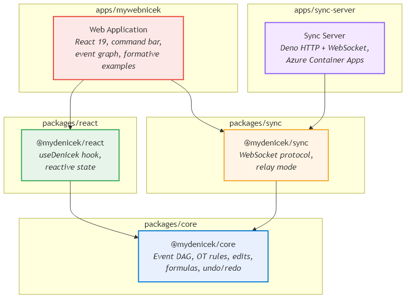
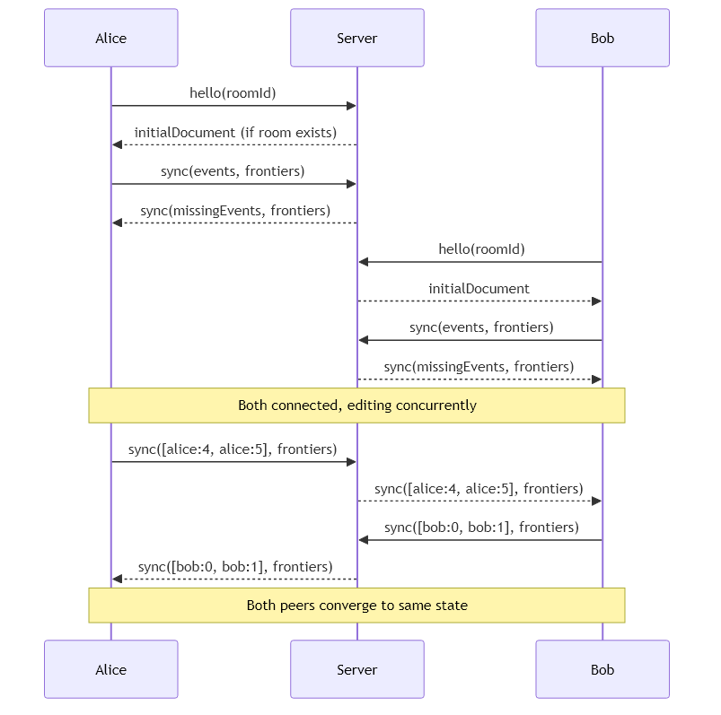
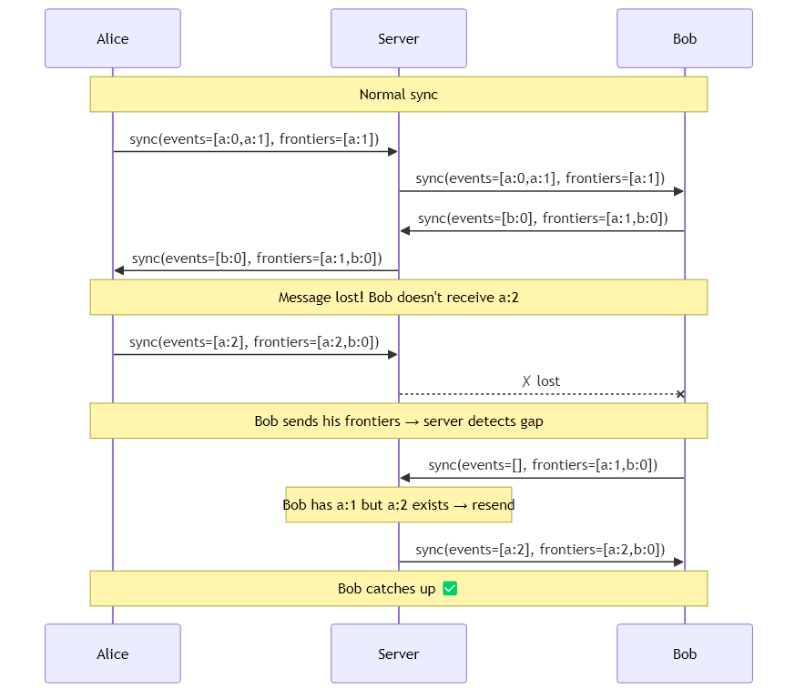

# Implementation {#chap:implementation}

This chapter describes the architecture and implementation of mydenicek --- a collaborative editing engine for tagged document trees. As motivated in [@Chap:journey], the engine uses selector-rewriting transformations on an event DAG rather than layering on top of an existing CRDT library. These transformations are structurally similar to Operational Transformation (OT) --- they rewrite selectors through concurrent structural edits --- but the overall system is framed as a pure operation-based CRDT, not an OT system: convergence follows from the pure view function over a G-Set, not from the classical OT properties TP1/TP2. When subsequent sections refer to "OT" or "OT-style" transformations, they mean selector rewriting specifically, not the full OT framework. The implementation is a Deno monorepo published on JSR as `@mydenicek/core`, `@mydenicek/react`, and `@mydenicek/sync`.

## Architecture overview {#sec:architecture}

The system is organized in five packages, as shown in [@Fig:architecture].

{#fig:architecture width=70%}

The packages are:

- **`packages/core`** (`@mydenicek/core`\footnote{\url{https://jsr.io/@mydenicek/core}}) --- the collaborative editing engine. Contains the document model, event DAG, edit types, selector rewriting rules, undo/redo, formula engine, and recording/replay. Minimal runtime dependency: only `@std/data-structures/binary-heap` from the Deno standard library, used for the Kahn priority queue. Pure TypeScript, no WASM. The core has no concept of a server or network --- it only knows about events and peers, making it compatible with any transport layer.
- **`packages/react`** (`@mydenicek/react`\footnote{\url{https://jsr.io/@mydenicek/react}}) --- React bindings. The `useDenicek` hook provides reactive document state, mutation helpers, and sync lifecycle management.
- **`packages/sync`** (`@mydenicek/sync`\footnote{\url{https://jsr.io/@mydenicek/sync}}) --- a client-server sync implementation built on top of the core. Provides a WebSocket-based client and relay server for exchanging events via a central server. The server operates in *relay mode*: it stores and forwards events without materializing documents or understanding edit semantics. This package is one possible transport --- the core could equally be used with peer-to-peer transport such as WebRTC.
- **`apps/mywebnicek`** --- web application. React 19 + Fluent UI interface with a terminal-style command bar, rendered document view, raw JSON view, and event DAG visualization.
- **`apps/sync-server`** --- deployed sync server. A Deno HTTP server that hosts WebSocket rooms using `@mydenicek/sync`, persists events to disk, and runs on Azure Container Apps.

The layered design ensures that the core engine has no knowledge of the UI or transport layer, and the sync server has no knowledge of edit types. Custom primitive edits (such as `splitFirst` and `splitRest`) are registered only in the application layer and do not need to be known by the server.

### Core class architecture {#sec:core-classes}

The core engine is organized around five main class hierarchies:

- **`Denicek`** is the top-level facade. It owns an `EventGraph` and a peer ID, and exposes all editing operations (`add`, `delete`, `rename`, `insert`, `wrapRecord`, etc.) as methods that create `Edit` objects and commit them as `Event` objects to the graph. It also manages undo/redo stacks and replay.
- **`EventGraph`** stores all `Event` objects in a map keyed by `EventId`, maintains the current frontier, and implements materialization (deterministic topological replay), `resolveReplayEdit` (for recording/replay), and `ingestEvents` (for sync with causal delivery buffering).
- **`Event`** is an immutable value object containing an `EventId`, a list of parent `EventId`s, an `Edit`, and a `VectorClock`. Its `resolveAgainst` method transforms the edit through all previously applied concurrent edits during materialization.
- **`Node`** is the abstract base class for the four document node types: `RecordNode`, `ListNode`, `PrimitiveNode`, and `ReferenceNode`. Nodes support navigation by `Selector`, cloning, and structural mutation (used during materialization).
- **`Edit`** is the abstract base class for all edit types, described in detail in [@Sec:ot-architecture]. Each edit knows how to `apply` itself to a document, `transform` its selector through a prior edit, and `computeInverse` for undo.

`Selector` and `VectorClock` are value objects. `Selector` handles parsing, matching, wildcard expansion, and prefix comparison. `VectorClock` supports merge (component-wise max), dominance comparison, and advancement.

### Technology choices {#sec:tech-choices}

**TypeScript.** Local-first applications target the browser, where JavaScript is the dominant language. TypeScript adds static type safety, which is particularly valuable in a collaborative editing engine where subtle type errors (e.g., confusing a selector path with a plain string, or passing the wrong event structure) can cause silent convergence failures.

**Deno.** Deno is a JavaScript and TypeScript runtime created by Ryan Dahl, the original creator of Node.js. Unlike Node.js, Deno runs TypeScript natively without a compilation step and includes a built-in formatter, linter, and test runner. This eliminates the configuration overhead of separate tools (ESLint, Prettier, Jest, tsconfig) that a Node.js project would require.

**React.** React is a widely-used JavaScript library for building user interfaces, developed by Meta. The core engine is framework-agnostic, but the `@mydenicek/react` package provides React-specific bindings because React is the most mainstream frontend framework, making the library accessible to the widest audience.

**JSR.** JSR (JavaScript Registry) is a package registry developed by the Deno team as an alternative to npm. It accepts TypeScript source directly (npm requires pre-compiled JavaScript), which simplifies the publishing workflow. The three mydenicek packages are published on JSR.

## Document model {#sec:doc-model}

Documents are modeled as tagged trees with four node types:

- **Record** --- a set of named fields, each containing a child node, plus a structural tag.
- **List** --- an ordered sequence of child nodes with a structural tag.
- **Primitive** --- a scalar value: string, number, or boolean.
- **Reference** --- a pointer to another node via a relative or absolute path.

Reference nodes are unusual in collaborative editing systems. In most CRDT-based systems (Automerge, Loro, json-joy), nodes reference each other via opaque unique IDs --- stable across moves and structural changes, but unable to express relative relationships like "my sibling at index 0." CRDT spreadsheets (e.g., Sypytkowski's work) similarly use stable UIDs for cell references, avoiding the need for reference transformation entirely. In mydenicek, references are *path-based* (`../0/source`), meaning they navigate the tree relative to their position. This enables patterns like formula nodes referencing sibling data, but requires OT to keep references valid when structural edits (rename, wrap) change the paths they traverse.

Nodes are addressed by *selectors* --- slash-separated paths that describe how to navigate the tree from the root. The selector `speakers/0/name` navigates to the `speakers` field, then to the first list item (index 0), then to the `name` field. Unless stated otherwise, examples in this thesis use selectors *relative to the document root*, without a leading `/`. A leading `/` is only significant in reference nodes (see `Reference` above), where it distinguishes absolute paths from paths relative to the reference's own position. Selectors support three special forms:

- **Wildcards** (`*`): `speakers/*` expands to all children of the `speakers` list. An edit targeting `speakers/*` is applied to every item.
- **Strict indices** (`!0`): `speakers/!0` refers to the item at index 0 *at the time of the edit*. Unlike plain `0`, strict indices are not shifted by concurrent insertions --- they always refer to the original position. This is essential for the recording and replay mechanism described in [@Sec:replay].
- **Parent navigation** (`..`): used in references to navigate up the tree. `../../0/contact` goes up two levels, then navigates to `0/contact`.

[@Tbl:selector-notation] summarizes the selector notation used throughout this thesis.

: Selector notation summary. {#tbl:selector-notation}

| Form | Example | Meaning |
|------|---------|---------|
| Field name | `speakers/0/name` | Navigate by field name or list index (root-relative) |
| Wildcard | `speakers/*` | Expand to all children of the target node |
| Strict index | `speakers/!0` | Index at edit-creation time; not shifted by concurrent inserts |
| Parent (`..`) | `../../0/contact` | Navigate up the tree (used in `$ref` paths) |
| Absolute `$ref` | `$ref: "/speakers/0"` | Reference resolved from document root |
| Relative `$ref` | `$ref: "../0/source"` | Reference resolved from the reference node's own position |

## Event DAG {#sec:event-dag}

The event directed acyclic graph (DAG) is the core data structure of mydenicek. It is a grow-only, append-only structure --- events are immutable once created, and new events can only be added, never modified or removed. This makes the event set a G-Set (grow-only set), one of the simplest CRDTs: two peers that have received the same set of events will always produce the same document. Each edit creates an *event* containing:

- **EventId** --- a unique identifier `peer:seq`, where `peer` is the peer's string identifier and `seq` is a monotonically increasing sequence number. For example, `alice:3` is Alice's third event.
- **Parents** --- the set of event IDs that formed the *frontier* of the creating peer's DAG immediately before this event was appended. Equivalently, they are the most recent events the peer had seen. After the new event is inserted, those parents are no longer on the frontier --- the frontier collapses to this new event alone. An event with multiple parents therefore corresponds to the first edit after a sync that brought in another peer's branch, and is the merge point of the two branches.
- **Edit** --- the actual edit operation (add, delete, rename, set, insert, wrapRecord, etc.) with its target selector and arguments.
- **Vector clock** --- a map from peer ID to the highest sequence number seen from that peer. The vector clock enables causal ordering: event A *happens-before* event B if A's vector clock is dominated by B's. Two events are *concurrent* if neither dominates the other.

Parents and vector clocks serve complementary roles. Parents define the direct edges of the DAG --- they are needed for topological sorting and for the sync protocol's `eventsSince(frontiers)` computation. Vector clocks summarize the full causal ancestry of an event, enabling efficient concurrency detection: checking whether two events are concurrent requires only comparing their vector clocks (O(P) where P is the number of peers) rather than traversing the DAG to test reachability. For example, Alice's event with clock `{alice: 5, bob: 3}` and Bob's event with clock `{alice: 2, bob: 4}` are concurrent because neither clock dominates the other (`alice: 5 > 2` but `bob: 3 < 4`).

For wire transport and persistence, events are serialized as JSON using a codec layer (`remote-edit-codec.ts` and `remote-events.ts`). Each `Edit` subclass implements `encodeRemoteEdit()` to produce its serialized form --- this works through polymorphism, since the encoder has a concrete `Edit` object and can call its method directly. Decoding is the inverse problem: the receiver has a plain JSON object and must reconstruct the correct `Edit` subclass, but does not know which class to instantiate until it reads the `kind` field. This is solved via a decoder registry: each edit type registers a decoder function via `registerRemoteEditDecoder(kind, decoderFn)` at module load time. The registry maps the `kind` string to the corresponding factory function, avoiding a central switch statement and keeping the codec extensible.

### Materialization

To reconstruct the document from the event DAG, we perform *deterministic topological replay*:

1. Sort all events in topological order using Kahn's algorithm. When multiple events have no unprocessed dependencies (i.e., they are concurrent), break ties deterministically by comparing their `EventId` values lexicographically.
2. Starting from the initial document, apply each event's edit in order. Before applying, call `resolveAgainst` --- the OT step that transforms the edit's selector through all previously applied concurrent edits.
3. If a transformed edit becomes invalid (e.g., it targets a node that was deleted by a concurrent edit), it becomes a *no-op conflict* that is recorded but does not modify the document. The original event remains in the DAG (events are immutable and never removed), and the conflict is recorded in a separate conflict list returned by `materialize()`. Application code can inspect these conflicts to inform the user, but no automatic recovery is attempted --- the event simply has no effect on the materialized document.

Two optimizations avoid replaying from scratch on every call:

- **Linear extension cache.** When a new event's parents exactly match the current frontier (the common case during local editing and live sync), the event is a *linear extension* of the graph. In that case, `resolveAgainst` is a no-op (every prior is a causal ancestor), so the edit is applied directly to the cached document in O(1) amortized time.
- **Checkpoint-based merge resumption.** When a merge invalidates the linear cache (because the new event has parents from a different branch), the current materialized state is saved as a *checkpoint* keyed by its frontier hash. On the next `materialize()`, the system finds the longest checkpoint whose topological order is a prefix of the current order and resumes replay from that point. This means a merge replays only the events after the fork point, not the entire history. Up to 16 checkpoints are retained with LRU eviction.

The `resolveAgainst` step is the heart of convergence. When the materializer is about to apply event E, it iterates over all previously applied events. For each prior event P, it first checks whether E's vector clock dominates P's --- if so, P is a causal ancestor of E and is skipped. Otherwise, if neither clock dominates the other, the events are concurrent, and the materializer calls `transformLaterConcurrentEdit(P.edit, E.edit)`, which rewrites E's selector (and potentially its payload) through P's structural effect. Transformations compose: if E is concurrent with priors P₁, P₂, and P₃, the edit is first transformed through P₁, then the result through P₂, then through P₃. The iteration is O(N) per event (where N is the total number of applied events), making the full materialization O(N²) in the worst case. In practice, most priors are causal ancestors and are skipped after a cheap vector clock comparison (O(P) where P is the number of peers). After all priors have been processed, the materializer checks whether the final transformed edit can still be applied to the current document state (via `canApply`). If not --- for example, because a concurrent delete removed the target node --- the edit is downgraded to a no-op conflict.

Because the sort order is deterministic and the selector-rewriting transformations are deterministic, any two peers that have received the same set of events produce the same document. This is the strong eventual consistency guarantee, stated precisely in [@Sec:crdt-framing] below.

### mydenicek as a pure op-based CRDT {#sec:crdt-framing}

Under the framing of [@Sec:crdts], mydenicek is a *pure operation-based CRDT* [@baquero2017pureop]. The replica state is the **set of all delivered events** $\mathcal{E}$. This set is a grow-only set (G-Set): a canonical state-based CRDT whose merge operation is set union, which is associative, commutative, and idempotent, so any two replicas with the same received events have the same state regardless of delivery order.

The document is not the state; it is a **pure view function** $\text{materialize}: 2^{\text{Event}} \to \text{Node}$ computed on demand. The view function is the composition of three pure steps described above: topological ordering with an `EventId` tie-break, `resolveAgainst` (selector rewriting through concurrent prior edits), and `apply` (executing the resolved edit against the current document).

**Assumption (peer-ID uniqueness).** Every `EventId = (peer, seq)` produced across the union of all replicas is globally unique. This is enforced at ingest (see [@Sec:peer-id]); any violation is rejected rather than silently overwritten.

**Lemma 1 (deterministic topological order).** *The function `topologicalOrder`, which applies Kahn's algorithm with a priority queue keyed on the lexicographic order of `EventId`s, is a total function of the event set $\mathcal{E}$.*

The DAG structure is determined by the events' `parents` lists, which are part of each event's immutable payload; Kahn's algorithm produces a unique topological order whenever the tie-breaker induces a total order on concurrent ready nodes. Under the uniqueness assumption, `EventId` lexicographic comparison is a strict total order on the elements of $\mathcal{E}$. The implementation accesses the events `Map` only via keyed `Map.get`, never via iteration order, so the output depends only on $\mathcal{E}$.

**Lemma 2 (pure selector resolution).** *`resolveAgainst(ev, applied, doc)` is a pure function of its three inputs.* The method only reads the input event's clock, walks the `applied` list sequentially, and calls each prior edit's `transformLaterConcurrentEdit` method, which is dispatched on the edit's class and has no hidden state. Concretely, the eleven edit types fall into three groups: (a) data edits (`RecordAddEdit`, `RecordDeleteEdit`, `SetEdit`, `ApplyPrimitiveEdit`) return the selector unchanged; (b) structural edits (`RecordRenameFieldEdit`, `UpdateTagEdit`, `WrapRecordEdit`, `WrapListEdit`, `ListInsertEdit`, `ListRemoveEdit`, `ListReorderEdit`) rewrite the selector and optionally the payload via `transformLaterConcurrentEdit`; and (c) `CopyEdit` rewrites both its target and source selectors. Each group's transformation logic reads only its own fields and the input selector --- no mutable globals, no iteration-order-dependent collections.

**Lemma 3 (pure application).** *`apply(edit, doc)` is a pure function: given identical inputs, it produces identical output documents.* The apply methods are small, local mutations over `RecordNode`, `ListNode`, `PrimitiveNode`, and `ReferenceNode`. They do not consult `Math.random`, `Date.now`, hash-map iteration order, or other implicit sources.

**Theorem (strong eventual consistency).** *Under the peer-ID uniqueness assumption, for any two replicas $R_1, R_2$ with $\mathcal{E}(R_1) = \mathcal{E}(R_2)$, $\text{materialize}(R_1) = \text{materialize}(R_2)$.*

**Proof sketch.** Let $e_1, e_2, \ldots, e_n$ be the topological order produced by Lemma 1, and let $d_0$ be the initial document. Define $d_k$ and $a_k$ (the applied-prefix list after step $k$) inductively:

- *Base case* ($k = 0$): $d_0$ is given and identical on both replicas; $a_0 = []$.
- *Inductive step*: Assume $d_{k-1}$ and $a_{k-1}$ are identical on both replicas. By Lemma 2, $\text{resolveAgainst}(e_k, a_{k-1}, d_{k-1})$ produces the same resolved edit $e'_k$ on both replicas. By Lemma 3, $d_k = \text{apply}(e'_k, d_{k-1})$ is the same on both replicas. The applied-prefix list $a_k = a_{k-1} \mathbin\| [e_k]$ is also identical (it is built by appending the same event). The induction carries through to $k = n$, giving $d_n = \text{materialize}(\mathcal{E})$ on both replicas. $\square$

Note that this is a *proof sketch* --- it establishes the logical structure of the convergence argument but delegates implementation-level determinism to the audit in [@Sec:determinism-audit]. Mechanical verification (e.g., in TLA+ or a proof assistant) is left as future work (see [@Sec:future-work]).

**What this theorem does and does not establish.** The theorem shows **convergence** --- the first property in the CCI correctness model of Sun et al. [@sun1998achieving]. **Causality preservation** follows from causal delivery (see [@Sec:causal-delivery]) combined with the DAG's `parents` edges. **Intention preservation** --- that the merged document reflects each user's intent --- is *not* formalized here; it is only validated empirically by the formative examples in [@Chap:formative]. Of the three CCI properties, only convergence is proven; a formal treatment of intention preservation would require a specification of what "user intent" means for each edit type under each class of concurrent interaction, which is an open problem even in the classical OT literature. The formative examples demonstrate that the chosen semantics produce reasonable results for the targeted use cases, but we do not claim that all possible concurrent interactions preserve intent in every scenario.

Because convergence alone is what the theorem proves, the classical OT transformation properties TP1 and TP2 [@ressel1996integrating] are not needed. TP1 and TP2 are correctness conditions for *peer-local* operational transformation, where two peers may apply concurrent operations in opposite local orders and must still reach the same state. In mydenicek every replica derives the document from the full event set via the same deterministic replay, so operation commutativity is not required for convergence. We do *not* claim that our selector-rewriting transformations would satisfy TP2 when composed pairwise in arbitrary orders --- we have no need to, because the replay order is fixed by the DAG.

**Deterministic replay vs. TP1 intention preservation.** The fixed replay order can produce different results from a TP1-satisfying pairwise OT system. Consider two peers concurrently adding the same record field: Alice executes `add("data", "title", "Alice's title")` and Bob executes `add("data", "title", "Bob's title")`. In a TP1-satisfying system with LWW semantics, both peers apply their own edit first, then transform the remote edit --- the winner is determined by a timestamp or logical clock. In mydenicek, the topological sort places the event with the lexicographically smaller `EventId` first (say Alice). Bob's concurrent `add` then resolves against Alice's already-applied `add`: the field exists, so Bob's edit overwrites it. The final value is `"Bob's title"` on both peers. The result is deterministic and convergent, but the "winner" is determined by peer ID order rather than by wall-clock time or user intent. For Denicek's primary use case --- structural transformations via wildcards, not character-level text --- this resolution granularity is coarse enough that "who wins" matters less than "does the structure converge." The wildcard-affects-concurrent-insertions semantics ([@Sec:wildcard-concurrent]) is an example where the deterministic replay actually *improves* intention preservation: Alice's schema evolution automatically applies to Bob's concurrently inserted items, which is the desired behavior.

**Concurrent structural conflicts.** Several concurrent scenarios deserve explicit discussion because they exercise the conflict-resolution semantics most directly.

*Concurrent renames of the same field.* Alice renames `name` to `fullName`, Bob renames `name` to `title`. The first rename in replay order succeeds; the second rename's selector is transformed through the first --- its source `name` becomes `fullName` --- so it renames `fullName` to `title`. The last rename in replay order wins: the field ends up under `title`.

*Concurrent wraps of the same target.* Alice wraps `value` into a `formula` record, Bob wraps `value` into a `container` record. The first wrap succeeds and adds a path segment; the second wrap's selector is transformed through the first, gaining an extra segment, and wraps the already-wrapped node a second level deep. This produces a doubly-wrapped structure --- the original value is nested inside two wrapper records instead of one. Neither peer intended this nesting; each expected a single wrapper. This is a known semantic compromise: the system preserves both peers' structural edits rather than discarding one, at the cost of producing a deeper tree than either peer intended. In practice, concurrent wraps of the exact same node are uncommon; when they do occur, the extra nesting is visible in the UI and can be corrected manually by unwrapping one level.

*Concurrent indexed insert and remove at the same position.* Starting from `["a", "b", "c"]`, Alice executes `insert("items", 0, "NEW")` and Bob executes `remove("items", 0)`. Both indices are non-strict, so OT shifts them through each other. The replay order determines which transformation fires:

- **Insert replayed first.** Alice's insert places `"NEW"` at index 0, producing `["NEW", "a", "b", "c"]`. Bob's remove originally targeted index 0 (`"a"`), but the preceding insert shifted it to index 1 --- still `"a"`. The remove deletes `"a"`, yielding `["NEW", "b", "c"]`.
- **Remove replayed first.** Bob's remove deletes `"a"` at index 0, producing `["b", "c"]`. Alice's insert at index 0 is not shifted (no preceding insert to shift through), so `"NEW"` lands at index 0. The result is `["NEW", "b", "c"]`.

Both orders converge to the same result: the original item is removed and the new item is inserted. This works because the non-strict index is transformed through the concurrent edit --- the insert shifts the remove's target, keeping it pointed at the same item.

*Concurrent strict insert and remove.* With strict indices (`strict=true`), the index is *not* shifted by OT --- it always refers to the position at replay time, not at creation time. A concurrent `insert("items", 0, "NEW", true)` and `remove("items", 0, true)` can cancel each other out: if the insert replays first, the remove targets index 0, which is now the *newly inserted* item rather than the original. The result is `["a", "b", "c"]` --- back to the original state. The same cancellation occurs with strict end-relative operations (`insert(-1, ..., true)` and `remove(-1, true)`). This is inherent to the "always the same position" semantics of strict indices. For concurrent list modifications where both peers intend to affect specific existing items, the non-strict (OT-shifted) variants provide better intent preservation.

*Concurrent double remove.* When both peers remove the same index concurrently, the second remove becomes a no-op conflict --- only one item is removed. This applies to both indexed and strict removes.

These behaviors follow mechanically from the selector-rewriting rules and the deterministic replay order; they are convergent by construction, though whether they always match user intent is application-dependent.

## Edit types and selector transformation rules {#sec:edit-types}

The system supports the following edit types, listed in [@Tbl:edit-types].

: Edit types supported by the mydenicek engine. {#tbl:edit-types}

| Edit type | Description | Target |
|-----------|-------------|--------|
| `RecordAddEdit` | Add a named field to a record | Record |
| `RecordDeleteEdit` | Delete a named field from a record | Record |
| `RecordRenameFieldEdit` | Rename a field | Record |
| `ListInsertEdit` | Insert an item at a given index | List |
| `ListRemoveEdit` | Remove the item at a given index | List |
| `ListReorderEdit` | Move an item from one index to another | List |
| `UpdateTagEdit` | Change a node's structural tag | Record or List |
| `WrapRecordEdit` | Wrap a node in a new parent record | Any |
| `WrapListEdit` | Wrap a node in a new parent list | Any |
| `CopyEdit` | Copy a subtree from a source to a target | Any |
| `ApplyPrimitiveEdit` | Apply a registered custom edit | Primitive |

Three additional edit types --- `UnwrapRecordEdit`, `UnwrapListEdit`, and `RestoreSnapshotEdit` --- exist as internal inverse operations. They are produced only by `computeInverse()` for undo and are not exposed as user-facing edits. `UnwrapRecordEdit` and `UnwrapListEdit` invert the corresponding wrap operations, while `RestoreSnapshotEdit` inverts `CopyEdit` by snapshotting the target subtree before the copy and restoring it on undo (see [@Sec:undo]).

Each structural edit (rename, wrap, delete, insert, remove, reorder) has a `transformSelector` method that rewrites the selector of a concurrent edit. The key transformation rules are:

- **Rename**: if a concurrent edit targets `speakers/0/name` and a rename changes `speakers` to `talks`, the concurrent edit's selector is transformed to `talks/0/name`.
- **WrapRecord**: if a concurrent edit targets `speakers/0/value` and a wrap turns `value` into `{$tag: "wrapper", value: <original>}`, the concurrent edit's selector gains a segment: `speakers/0/value/value`.
- **WrapList**: similar to WrapRecord but wraps into a list, adding an index segment.
- **Delete**: if a concurrent edit targets a field that was deleted, the edit becomes a no-op conflict.
- **Insert**: shifts numeric indices at or above the insertion point (e.g., `insert(items, 2, ...)` transforms `items/3` to `items/4` but leaves `items/1` unchanged). Strict-index inserts (`strict=true`) do not shift concurrent selectors.
- **Remove**: shifts numeric indices above the removal point down by one, and marks the exact index as removed (e.g., `remove(items, 2)` transforms `items/3` to `items/2`, and a concurrent edit targeting `items/2` becomes a no-op conflict). Strict-index removes do not shift concurrent selectors.
- **Reorder**: remaps indices to reflect the move (e.g., `reorder(items, 1, 3)` transforms `items/1` to `items/3`, and shifts items between the old and new positions accordingly).

To illustrate how transformations compose, consider a conference list where Alice, Bob, and Carol make concurrent edits: Alice renames the field `speakers` to `talks`, Bob wraps each item in a `<tr>` record (so `talks/0` becomes `talks/0/value`), and Carol edits the first speaker's name at `speakers/0/name`. During deterministic replay, suppose the topological order is Alice → Bob → Carol. Carol's selector `speakers/0/name` is first transformed through Alice's rename: the `speakers` prefix matches the rename, so the selector becomes `talks/0/name`. It is then transformed through Bob's wrap: the `talks/0` prefix matches the wrap target `talks/*`, so a `value` segment is inserted, yielding `talks/0/value/name`. Carol's edit now correctly targets the name field inside the new wrapper structure --- even though Carol's original selector knew nothing about the rename or the wrap. Each transformation examines only whether the concurrent edit's selector is a prefix of (or overlaps with) the edit being transformed, making the composition both local and linear in the number of prior concurrent edits.

### Two-level polymorphic design {#sec:ot-architecture}

A naive transformation implementation requires a rule for every pair of edit types --- $n^2$ rules for $n$ edit types. With 11 edit types, that would be 121 hand-written rules. mydenicek avoids this through a two-level object-oriented design, shown in [@Fig:edit-class-diagram].

{#fig:edit-class-diagram width=75%}

The design rests on two key methods in the `Edit` base class:

- **`transformSelector(sel)`** --- given another edit's selector, returns the transformed selector after this edit's structural effect. For example, a rename from `speakers` to `talks` transforms the selector `speakers/0/name` into `talks/0/name`. Non-structural edits (add, set, etc.) return the selector unchanged.
- **`transformLaterConcurrentEdit(concurrent)`** --- given a concurrent edit that will replay *after* this one, returns a transformed version of the concurrent edit. The default implementation simply calls `concurrent.transform(this)`, which rewrites the concurrent edit's target selector through `transformSelector`. This handles the vast majority of edit pairs.

**Why this avoids n² rules.** The default `transformLaterConcurrentEdit` delegates to `transformSelector`, which each edit type implements once. A `RenameFieldEdit` knows how to transform *any* selector (not just selectors from specific edit types), so one method handles all pairs involving rename. This gives n methods total instead of n².

**When the default is insufficient.** Selector rewriting alone does not handle cases where a structural edit must modify the *payload* of a concurrent list insert. Consider: `updateTag("items/*", "tr")` is concurrent with `insert("items", -1, {$tag: "li", ...}, true)`. The default would only transform the insert's target selector (which is `items`, unchanged by the tag edit). But the *inserted node* should also change its tag from `<li>` to `<tr>`. To handle this, `UpdateTagEdit`, `WrapRecordEdit`, and `WrapListEdit` override `transformLaterConcurrentEdit` to detect concurrent `ListInsertEdit` instances and call `rewriteInsertedNode`, which modifies the inserted node's payload before it enters the document. Only structural edits that change the document shape need this override --- it scales linearly with the number of structural edit types.

### CopyEdit and mirroring {#sec:copy-edit}

`CopyEdit` extends `Edit` directly (not `NoOpOnRemovedTargetEdit`) because it has two selectors --- `target` and `source` --- both of which must be checked for removal. If either is deleted by a concurrent edit, the copy becomes a no-op. More importantly, `CopyEdit` *mirrors* concurrent edits: when a concurrent edit modifies the source, the same modification is replicated onto the copy target. This is implemented by `transformLaterConcurrentEdit` wrapping the concurrent edit in a `CompositeEdit` that applies it to both the original target and the mirrored copy target. This ensures that copied data stays consistent with its source as both evolve under concurrent editing.

### Wildcard edits and concurrent insertions {#sec:wildcard-concurrent}

A notable property of the replay-based view function is how wildcard edits interact with concurrent insertions, illustrated in [@Fig:wildcard-diamond]. *This is a deliberate design choice*, not a consequence of the convergence proof: both "wildcard includes concurrent inserts" and "wildcard does not include concurrent inserts" are pure view functions and therefore both yield strong eventual consistency. We choose the former because wildcard edits are a core feature of Denicek's end-user programming model --- users apply structural transformations to all items in a list (e.g., refactoring a conference list into a table, as demonstrated in [@Sec:conf-concurrent]). When one user refactors the list while another concurrently adds new items, the new items should also be refactored.

When Alice applies `updateTag("speakers/*", "tr")` --- changing the tag of every item in the list --- and Bob concurrently inserts a new item via `insert("speakers", -1, ..., true)`, the result is that Alice's tag update also affects Bob's newly inserted item.

{#fig:wildcard-diamond width=55%}

This holds regardless of replay order, but the mechanism differs in each case:

- **Insert first** (Bob's `insert` is replayed before Alice's wildcard edit): Bob's new item is added to the list. When Alice's `updateTag("speakers/*", "tr")` is then replayed, the wildcard `*` expands to include *all items that exist at the point of replay* --- including Bob's concurrent insertion. The tag update naturally applies to the new item without any transformation needed.
- **Edit first** (Alice's wildcard edit is replayed before Bob's `insert`): Alice's `updateTag` is applied to the existing items. When Bob's `insert` is then resolved against Alice's preceding wildcard edit, the selector-rewriting step modifies the inserted item: instead of inserting a `<li>` item, the transformed insert produces a `<tr>` item. This works because materialization replays events in a deterministic order --- when Bob's insert comes after Alice's wildcard edit in that order, the insert is transformed to be consistent with the already-applied edit.

This semantics is uncommon in CRDTs. In most CRDT-based systems, an operation only affects the items that existed at the time the operation was created. Items inserted concurrently by other peers are not affected. Weidner [@weidner2023foreach] describes this as the *for-each* problem and proposes a dedicated CRDT operation to address it. In mydenicek, the replay-based view function naturally achieves the "for-each-including-concurrent-additions" semantics because the wildcard is expanded at replay time, not at creation time --- no special for-each CRDT is needed.

## Extensibility, formulas, and undo {#sec:extensibility-formulas-undo}

### Extensibility {#sec:extensibility}

The core engine is designed to be extended by application code without modifying the engine itself. Two extension points use the *registry* pattern --- a global map from names to implementations:

**Primitive edits.** Applications can register custom transformations on primitive values via `Denicek.registerPrimitiveEdit(name, fn)`. The function receives the current value and optional arguments, and returns the new value. For example, the conference table app registers `splitFirst` and `splitRest` to split comma-separated strings. Registered edits are stored by name in the event DAG and replayed on all peers --- each peer must register the same implementation before materializing. The sync server does not need to know about primitive edits because it operates in relay mode.

**Formula operations.** Applications can register custom formula operations via `registerFormulaOperation(name, fn)` for operation-based formulas, and `registerTagEvaluator(tag, fn)` for tag-based formulas. Built-in operations (sum, product, concat, etc.) are pre-registered at module load time using the same mechanism, so there is no distinction between built-in and user-defined operations at runtime.

The `Denicek` class itself follows the *facade* pattern: it provides a single entry point for all editing operations (`add`, `rename`, `wrapRecord`, `insert`, `undo`, `replay`, etc.), delegating to the `EventGraph`, `Edit` subclasses, and formula engine internally. The public API uses plain values (`PlainNode` objects and selector strings) rather than exposing internal classes like `Node`, `Edit`, or `EventGraph`.

### Formula engine {#sec:formulas}

The formula engine supports two kinds of formulas:

- **Tag-based evaluators** --- registered for specific node tags. For example, a `RecordNode` with tag `split-first` containing a `source` field and a `separator` field evaluates to the substring before the separator. Pre-registered tag evaluators include `x-formula-plus`, `x-formula-minus`, `x-formula-times`, `split-first`, and `split-rest`.
- **Operation-based formulas** --- `RecordNode`s with tag `x-formula` and an `operation` field. Arguments are provided as a `ListNode` that may contain `PrimitiveNode` values or `ReferenceNode` references. Pre-registered operations include `sum`, `product`, `concat`, `uppercase`, `lowercase`, `countChildren`, and others.

References in formula arguments are resolved relative to the formula's position in the tree. The formula engine walks the entire document tree, evaluates all formula nodes, and returns a map from path to result. Circular references are detected and reported as errors.

The formula engine operates directly on the internal `Node` tree rather than the serialized `PlainNode` representation. This means reference nodes (`ReferenceNode`) are handled natively: their selectors --- already retargeted by `updateReferences` after structural edits --- are resolved via `ReferenceNode.resolveReference` and the resulting absolute path is navigated using `Node.navigate`. No string-based path parsing or re-resolution is needed inside the formula engine; the reference infrastructure used by the edit pipeline is reused as-is.

The evaluation algorithm works as follows. `evaluateAllFormulas` uses `Node.forEach` to walk the tree with its `Selector`-typed path. When it encounters a `RecordNode` whose tag matches a registered tag evaluator or starts with `x-formula`, it calls `evaluateFormulaNode`, which dispatches to the appropriate evaluator. Reference nodes are resolved transparently before any evaluator sees them: an internal `evaluateChild` helper checks the node type --- `PrimitiveNode` values pass through directly, `ReferenceNode` instances are resolved to their target via `ReferenceNode.resolveReference` and `Node.navigate`, and nested formula `RecordNode`s are evaluated recursively. Evaluators only ever receive primitives or nested formula results, never raw reference objects. For tag-based formulas, the evaluator receives the `RecordNode` and a callback that invokes `evaluateChild` on each child field; for operation-based formulas, the engine collects the `args` list items, resolves each argument through the same transparent resolution, and invokes the registered operation function.

Reference resolution supports both absolute paths (starting with `/`, resolved from the document root) and relative paths (resolved from the reference's own position in the tree). Relative paths use `..` segments for parent navigation: `ReferenceNode.resolveReference` combines the reference's base path with its selector segments, then resolves `..` by popping from a stack, producing an absolute `Selector` that is navigated through the `Node` tree. When a wildcard appears in a reference path, `Node.navigate` resolves it to multiple nodes --- all of which are flattened into the argument list. This is how `sum({$ref: "../*/price"})` sums all `price` fields across sibling list items. Circular references are detected by tracking the set of formula paths currently being evaluated; if a formula's path is already in the visiting set, the engine returns a `FormulaError` instead of recursing infinitely. This also handles the edge case where a wildcard reference expands to include the formula node itself --- the self-reference is caught by the same visited-set check before any infinite recursion occurs. Evaluation depth is also capped at 100 levels as a defense-in-depth measure against pathological nesting.

### Undo and redo {#sec:undo}

Each `Edit` subclass implements a `computeInverse(preDoc)` method that returns the inverse edit. For example, the inverse of `RecordAddEdit("field", value)` is `RecordDeleteEdit("field")`, and the inverse of `WrapRecordEdit` is `UnwrapRecordEdit`. The `preDoc` parameter is needed because some inverses depend on the document state before the edit --- for example, to undo a delete, the inverse must know the deleted value so it can re-add it.

Undo creates a new event containing the inverse edit. This event is a regular event in the DAG --- it syncs to other peers automatically, so all peers see the undo. Redo re-applies the original edit as yet another new event. The undo/redo stacks are maintained per-peer and only track local events --- remote events are never undone locally. A new edit after an undo clears the redo stack, matching the undo behavior users expect from desktop applications.

A subtlety arises when undo interacts with concurrent remote events. The inverse edit is computed against the document state at the *original event's parent frontier* --- that is, the state just before the undone edit was first applied --- not the current document state. This is causally correct: the undo cancels exactly the effect of the original edit, regardless of what other events have been applied concurrently. However, the resulting behavior may be unintuitive in some scenarios. For example, if Alice adds a field and Bob concurrently modifies a sibling field, Alice's undo removes her addition but does not interact with Bob's modification --- even if the two fields are semantically related. The undo event is then a new event in the DAG, and other peers apply it through the normal materialization pipeline. This design ensures convergence (the undo is just another event in the G-Set) but means that undo reverses the effect of one specific edit, not the entire document state --- concurrent changes by other peers are preserved.

`CopyEdit` requires special handling because it overwrites a (possibly wildcard-expanded) target subtree. Its `computeInverse` snapshots every target node before the copy, producing a `RestoreSnapshotEdit` (or a `CompositeEdit` of multiple `RestoreSnapshotEdit` instances for wildcard targets) that restores each overwritten subtree on undo. This snapshot-based inverse incurs a per-copy overhead proportional to the size of the overwritten subtrees. For wildcard copies, each expanded target is individually snapshotted and restored.

## Recording and replay {#sec:replay}

Programming by demonstration is implemented through event recording and replay.

A naive approach --- simply re-executing the recorded edit on the current document --- does not work because the document structure may have changed since recording. If Alice recorded `insert("items", 0, ..., true)` but someone later renamed `items` to `speakers`, the original selector no longer resolves. Even if the field still exists, structural edits like wraps may have added extra path segments that the original selector does not account for.

The solution is to use OT to transform the recorded edit's selector through every structural change that happened after the recording. This produces the same result as if the replay had been executed concurrently with the original edit --- the OT transformations account for exactly the same structural changes that a concurrent event from the recording point would encounter during materialization.

The replay mechanism works in three steps:

1. **Recording.** When a user performs an edit, the resulting event ID is stored in a list of *replay steps* --- typically attached to a button node in the document.
2. **Replay.** When the user triggers a replay, the system replays the full event history in topological order. When it reaches the source event, it captures its edit. It then continues replaying --- each later *structural* edit (rename, wrap, delete) transforms the captured edit's selector via OT. The final transformed edit is committed as a new event at the current frontier. For example, if the recorded edits targeted `items` but a later rename changed `items` to `speakers`, the replayed edits target `speakers`.
3. **Batch replay.** When replaying multiple steps as a batch (e.g., all steps of an "Add Speaker" button), all source edits are resolved before any are committed. This prevents the replayed steps from retargeting each other.

Strict indices (`!0`) are essential for replay: a regular index `0` would be shifted by later insertions, causing the copy to target the wrong item. The strict index `!0` refers to position 0 *at the time of the original edit*, which OT does not shift through later insertions.

To avoid re-materializing the entire history on every replay, the event graph caches the resolved edit list from the last full materialization. Subsequent replay calls scan the cached list instead of replaying from scratch. The cache is invalidated when new events are added. This reduces the cost of N consecutive replays from N full materializations to one materialization plus N scans of the cached list.

## Sync protocol {#sec:sync}

The event DAG is a purely peer-to-peer data structure --- convergence requires only that all peers eventually receive the same set of events, regardless of how they are delivered. Peer-to-peer transport (e.g., via WebRTC) is possible but was not the focus of this work. For simplicity, mydenicek uses a centralized relay server that all peers connect to via WebSocket, similarly to how Automerge and Loro provide their own sync servers. The relay server stores and forwards events but does not interpret them --- it could be replaced by any transport that delivers events reliably.

The sync protocol uses WebSocket connections with a simple message exchange, illustrated in [@Fig:sync-protocol].

{#fig:sync-protocol width=80%}

The protocol consists of three phases:

1. **Connect.** The client sends a `hello` message with the room ID. If the room exists, the server responds with the initial document.
2. **Sync.** The client sends its locally created events that the server has not yet seen (computed via `eventsSince(knownServerFrontiers)`) along with its current frontiers. The server responds with events the client has not seen (computed via `eventsSince(clientFrontiers)`).
3. **Ongoing.** As either peer produces new events, they are exchanged via the same sync message format.

The server maintains a `SyncRoom` for each room, containing a `Denicek` instance in *relay mode*. In relay mode, the server stores and forwards events without materializing the document --- the `validateEventAgainstCausalState` step is skipped. This means the server does not need to know about custom primitive edits or formula evaluators; it only needs to understand the event structure.

Initial documents are validated by hash: the first client to sync with a room sets the room's initial document hash, and subsequent clients must match it. Room creation is safe under concurrent connections because Deno's event loop guarantees that the bootstrap code (hash check and initial document assignment) runs to completion between `await` suspension points --- two peers connecting simultaneously cannot both set a different initial document. Each incoming WebSocket message triggers event ingestion and response computation, followed by asynchronous file persistence. Different rooms are processed independently; within a room, messages are handled one at a time by the event loop, which is sufficient for the typical workload of a few peers per room.

All messages are JSON-encoded and distinguished by a `type` discriminator field. A sync request from client to server contains `type: "sync"`, the `roomId`, the client's current `frontiers` (an array of event ID strings), and an `events` array of new events to send. The first sync also includes the `initialDocument` (the plain-node tree) and its hash. A sync response from server to client mirrors this structure: `type: "sync"`, the `roomId`, the server's `frontiers`, and the `events` the client has not seen. The `hello` message sent on connection contains just `type: "hello"`, the `roomId`, and optionally the room's `initialDocument` if one has already been set by a prior peer.

Each event in the `events` array is serialized as a JSON object with four fields: `id` (an object with `peer` string and `seq` number), `parents` (an array of such ID objects), `clock` (a plain JSON object mapping peer strings to sequence numbers), and `edit` (the encoded edit payload). The edit payload is a discriminated union keyed by `kind`, for example:

    {"kind": "RecordRenameFieldEdit",
     "target": "speakers", "from": "name", "to": "fullName"}

Structural edits carry their target selector as a string and any additional parameters (the new field name, the wrapper tag, inserted node trees). This encoding is defined by the `EncodedRemoteEdit` type in `remote-edit-codec.ts`, with each edit class implementing `encodeRemoteEdit()` and a corresponding decoder registered via `registerRemoteEditDecoder()`. The decoder registry is populated at module load time, ensuring that all edit types are available for deserialization on any peer.

### Reliability through frontier-based sync {#sec:reliability}

Network communication is unreliable --- WebSocket connections can drop unexpectedly due to network changes, server restarts, or client hibernation. Within a single WebSocket connection, TCP guarantees ordered and reliable delivery: messages arrive exactly once and in the order they were sent. However, when a connection drops, any in-flight messages are lost, and the new connection has no memory of the previous one. The sync protocol handles connection drops through a single mechanism: *frontier-based catch-up*.

Every sync message --- in both directions --- includes the sender's current *frontiers* and new events computed via `eventsSince(knownRecipientFrontiers)`. Each side tracks the last-known frontiers of the other. When the client sends a sync message, the server ingests the client's events and sends back a sync message with its own frontiers and any events the client is missing. By updating `knownServerFrontiers` from the server's message, the client learns which events the server has ingested. There is no separate acknowledgment protocol --- the bidirectional frontier exchange serves double duty as both data sync and confirmation. This design has several important properties:

- **Connection drop with in-flight server message.** The client's known server frontiers do not advance. On reconnection, the client sends the same frontiers, and the server resends the missing events.
- **Connection drop with in-flight client message.** The client never received a reply, so its `knownServerFrontiers` did not advance. On reconnection, the next sync message recomputes `eventsSince(knownServerFrontiers)` and includes the unsent events again.
- **Out-of-order event delivery.** While TCP preserves message order within a connection, events from different peers may arrive in an order that violates causal dependencies (e.g., the server relays Bob's event that depends on Alice's event before Alice's event arrives). The event graph buffers such events until the missing parents arrive. The `ingestEvents` method maintains a buffer of pending events and flushes them in causal order as dependencies are satisfied.
- **Duplicate events.** If an event is received twice (e.g., due to a retry after an ambiguous connection drop), the event graph detects that the event ID already exists and ignores the duplicate. Events are idempotent by design.
- **Reconnection after long offline period.** When a client reconnects, it simply sends its current frontiers. The server computes the difference and sends all missing events --- whether the client was offline for seconds or days.

[@Fig:sync-reliability] illustrates how frontier-based sync recovers from a lost message.

{#fig:sync-reliability width=80%}

### Compaction and offline edits {#sec:compaction-offline}

When the event graph grows beyond a configurable threshold (50 events by default), the server attempts *compaction*: it waits until all active peers (those seen within a 5-minute activity window) have acknowledged the same frontier, materializes the document at that frontier, and replaces the room's event history with the materialized document as a new initial state. Peers that were offline during compaction receive a `compactedDocument` reset on their next sync.

A key concern is preserving edits that a peer made offline. The `resetToCompactedState` method handles this by saving the peer's unsynced local events before replacing the event graph with the compacted state. After ingesting any remaining events from the server's response, the saved edits are re-applied against the new compacted state. If a saved edit no longer applies --- for instance, because its target was deleted during the compacted history --- the re-apply fails silently and the edit is dropped. **This is a form of silent data loss**: the user's offline work is discarded without notification. A production system should log these failures, surface them as conflicts in the UI, or allow the user to manually resolve them. The current implementation prioritizes convergence over completeness in this edge case.

### Peer-ID uniqueness and threat model {#sec:peer-id}

Convergence in [@Sec:crdt-framing] rests on `EventId`s (pairs of peer identifier and per-peer sequence number) being globally unique. Two distinct events with the same `EventId` would let two different payloads inhabit the same node in the DAG at different peers, silently breaking strong eventual consistency. The implementation assumes an honest-but-fallible network: peer identifiers are assigned on first use and are expected to be unique for the lifetime of a given replica's event history (for example, via a random UUID generated at first launch and stored persistently).

Two concrete failure modes are worth calling out. *Peer-ID collision* --- two replicas independently generating the same peer identifier --- will cause `EventGraph.insertEvent` to detect a duplicate key when the second peer's events reach the first. The implementation raises an explicit error in this case (same key, different payload) rather than silently overwriting, but it cannot *recover* from the collision; the receiving replica must discard the conflicting branch or treat the two replicas as forked applications. *State restoration from a stale backup* --- a peer reusing an already-issued `(peer, seq)` pair after partial state loss --- is indistinguishable on the wire from malicious forgery and is likewise rejected at ingest. In both cases the implementation fails loudly, which is preferable to silent divergence, but we do not claim Byzantine fault tolerance: a truly malicious peer that controls its own `peer` identifier can always fork its own branch, and the honest peers will accept the fork if the `(peer, seq)` pairs do not collide with previously seen ones.

### Server architecture {#sec:server-architecture}

**Server architecture.** The sync server operates in *relay mode*: it stores and forwards events without materializing documents or running OT transformations. The computationally expensive work --- topological replay, `resolveAgainst`, and selector rewriting --- happens entirely on the client side. This means the server's per-message cost is limited to JSON parsing, inserting events into an in-memory `Map`, computing the frontier diff (`eventsSince`), and JSON encoding the response. Disk persistence is asynchronous and non-blocking: new events are appended to the NDJSON log in the background while the event loop continues processing other WebSocket messages. Because the server never calls `resolveAgainst`, the O(N²) materialization cost discussed in [@Sec:performance] does not affect server scalability.

The server uses Deno's single-threaded event loop. Rooms are independent (no shared state), so messages from different rooms are naturally interleaved without locks. For a production deployment with hundreds of concurrent rooms, a Worker-per-room architecture (Deno Workers provide separate JavaScript threads with isolated heaps) would provide stronger isolation, but the relay-mode design makes this unnecessary at the current scale.

**Room eviction.** Rooms are loaded into memory on first client connection and evicted after 10 minutes of inactivity with no connected clients. Evicted rooms remain on disk and are transparently reloaded when a client reconnects. This prevents unbounded memory growth from abandoned rooms while keeping active rooms fast (no disk access on each sync message).

**Disk persistence.** Room state is persisted as two files per room: a metadata file (`{roomId}.meta.json`) containing the initial document and its hash, written once on room creation, and an append-only event log (`{roomId}.events.ndjson`) in newline-delimited JSON format, where each line is one encoded event. New events are appended after each sync message using the POSIX append mode, which avoids rewriting the entire file. On load, the server reads the metadata and replays the event log. This append-only design matches the immutable nature of the event DAG --- events are never modified or deleted (except during compaction, which rewrites both files). A crash between sync and the append completing could lose the most recent events; on restart, rooms are recovered from the last successfully appended state.

## Web application {#sec:webapp}

The web application (`apps/mywebnicek`) serves as both a demonstration of the core engine and a tool for interactively exploring collaborative editing scenarios. It is built with React 19 and Microsoft's Fluent UI component library, and connects to the sync server via WebSocket.

### Integration with the core engine

The application uses the `useDenicek` hook from `@mydenicek/react`, which wraps the core `Denicek` instance and provides:

- **Reactive document state** --- the hook re-renders the component whenever the document changes, whether from local edits or remote events arriving via sync.
- **Sync lifecycle** --- the hook manages the WebSocket connection, automatically sending local events to the server and ingesting remote events. Connection status (connected, connecting, disconnected) is displayed in the header.
- **Peer identity** --- each browser tab generates a unique peer ID (stored in `sessionStorage` to survive page refreshes) that identifies events in the causal DAG.

### User interface

The interface provides three synchronized panels, each showing a different aspect of the same document state:

- **Rendered view** --- the document tree rendered as HTML elements based on node tags. Formula nodes display their evaluated results. Buttons trigger replay of recorded edit sequences.
- **Raw JSON view** --- syntax-highlighted JSON representation of the materialized document tree, useful for understanding the exact structure.
- **Event graph view** --- an SVG visualization of the causal DAG showing events as nodes, causal dependencies as edges, peer colors, and frontier indicators. Clicking an event shows its details (edit type, selector, vector clock).

### Command bar

The command bar at the bottom provides a terminal-style interface for executing edits. The syntax is:

    /selector command args

For example, `/speakers updateTag table` changes the tag of the speakers node, and `/speakers/*/0/contact splitFirst ,` applies the `splitFirst` edit to every row's contact field. Tab completion suggests path segments based on the current document structure, and valid commands for the selected node type. All registered primitive edits (including application-defined ones like `splitFirst` and `splitRest`) are automatically available as commands via `listRegisteredPrimitiveEdits()`.

### Document initialization

On first load, the application initializes a template document (a conference list) and registers application-specific primitive edits and recorded action sequences. When joining an existing room, the application fetches the current document state from the sync server instead of using the template.

## CI/CD and hosting {#sec:ci-hosting}

### Continuous integration and deployment {#sec:ci}

The project uses GitHub Actions for continuous integration. Every push to the `main` branch triggers five parallel CI jobs: formatting check, linting (including JSDoc validation), type checking, tests (206+ unit tests, 6 formative example tests, sync tests), and build verification. All five must pass before any deployment proceeds.

After CI passes, the web application is deployed to GitHub Pages as a static site, and the sync server is deployed to Azure (see [@Sec:hosting]). After both deployments complete, Playwright browser tests run against the live site to verify that two browser peers can connect, sync edits, and produce consistent document states.

JSR package publishing is a separate workflow (`deno publish`) triggered manually on demand, since package versions should be bumped deliberately rather than on every push. Publishing through GitHub Actions rather than locally is important for *provenance*: JSR uses GitHub's OIDC tokens to generate a cryptographic attestation (via Sigstore) that links each published package version to a specific Git commit and CI workflow. This allows consumers to verify that the package was built from the claimed source code and was not modified after the fact. Local publishing cannot provide this guarantee because there is no trusted build environment.

### Hosting {#sec:hosting}

**Web application.** The Vite build output is deployed as a static site to GitHub Pages. The application is a single-page app that connects to the sync server via WebSocket.

**Sync server.** The sync server runs as a Docker container on Azure Container Apps. Container Apps was chosen because it scales to zero (no cost when idle), supports WebSockets without a separate per-instance connection limit, and requires no pre-allocated plan.[^azure-alternatives] The trade-off is a *cold start* delay: when the container has scaled to zero, the first WebSocket connection takes a few seconds while the container starts up.

[^azure-alternatives]: Alternatives considered: Azure App Service (no scale-to-zero; the free F1 tier caps WebSockets at five concurrent connections per instance [@azure_app_service_limits]; the cheapest plan with unlimited connections, Basic B1, costs approximately \$100/month regardless of usage), Azure Container Instances (no scale-to-zero, no built-in HTTPS ingress, no automatic restarts), and Azure Kubernetes Service (full orchestration, unnecessary complexity for a single container).

The deployment builds a Docker image via Azure Container Registry, then deploys it using a Bicep infrastructure-as-code template. Event data is persisted to an Azure Files *share* --- a network-mounted file system, analogous to an SMB network drive --- attached to the container. Azure Files was chosen over Blob Storage or Table Storage because it provides a POSIX file system interface, allowing the sync server to read and write JSON files directly without needing a storage SDK.

The source code is available at <https://github.com/krsion/mydenicek> and the live demo is deployed at <https://krsion.github.io/mydenicek>.
