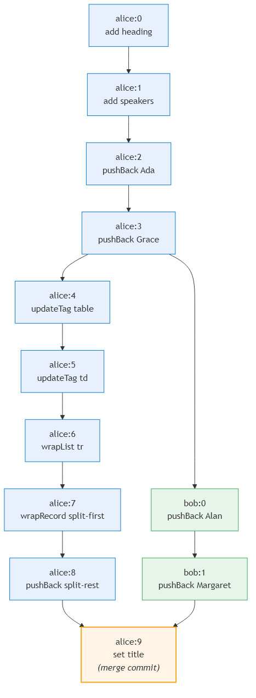

# Implementation {#chap:implementation}

This chapter describes the architecture and implementation of mydenicek --- a collaborative editing engine for tagged document trees. As motivated in [@Chap:journey], the engine uses operational transformation on an event DAG rather than layering on top of an existing CRDT library. The implementation is a Deno monorepo published on JSR as `@mydenicek/core`, `@mydenicek/react`, and `@mydenicek/sync`.

## Architecture overview {#sec:architecture}

The system is organized in four layers, as shown in [@Fig:architecture].

{#fig:architecture width=70%}

The layers are:

- **`packages/core`** (`@mydenicek/core` [@mydenicek_core]) --- the collaborative editing engine. Contains the document model, event DAG, edit types, OT transformation rules, undo/redo, formula engine, and recording/replay. Zero external runtime dependencies; pure TypeScript.
- **`packages/react`** (`@mydenicek/react` [@mydenicek_react]) --- React bindings. The `useDenicek` hook provides reactive document state, mutation helpers, and sync lifecycle management.
- **`packages/sync`** (`@mydenicek/sync` [@mydenicek_sync]) --- sync protocol. WebSocket-based client and server for exchanging events between peers. The server operates in *relay mode*: it stores and forwards events without materializing documents or understanding edit semantics.
- **`apps/mywebnicek`** --- web application. React 19 + Fluent UI interface with a terminal-style command bar, rendered document view, raw JSON view, and event graph DAG visualization.
- **`apps/sync-server`** --- deployed sync server. A Deno HTTP server that hosts WebSocket rooms using `@mydenicek/sync`, persists events to disk, and runs on Azure Container Apps.

The layered design ensures that the core engine has no knowledge of the UI or transport layer, and the sync server has no knowledge of edit types. Custom primitive edits (such as `splitFirst` and `splitRest`) are registered only in the application layer and do not need to be known by the server.

### Technology choices {#sec:tech-choices}

**TypeScript.** Local-first applications target the browser, where JavaScript is the dominant language. TypeScript adds static type safety, which is particularly valuable in a collaborative editing engine where subtle type errors (e.g., confusing a selector path with a plain string, or passing the wrong event structure) can cause silent convergence failures.

**Deno.** Deno is a JavaScript and TypeScript runtime created by Ryan Dahl, the original creator of Node.js. Unlike Node.js, Deno runs TypeScript natively without a compilation step and includes a built-in formatter, linter, and test runner. This eliminates the configuration overhead of separate tools (ESLint, Prettier, Jest, tsconfig) that a Node.js project would require.

**React.** React is a widely-used JavaScript library for building user interfaces, developed by Meta. The core engine is framework-agnostic, but the `@mydenicek/react` package provides React-specific bindings because React is the most mainstream frontend framework, making the library accessible to the widest audience.

**JSR.** JSR (JavaScript Registry) is a package registry developed by the Deno team as an alternative to npm. It accepts TypeScript source directly (npm requires pre-compiled JavaScript), which simplifies the publishing workflow. The three mydenicek packages are published on JSR.

### Continuous integration and deployment {#sec:ci}

The project uses GitHub Actions for continuous integration. Every push to the `main` branch triggers five parallel CI jobs: formatting check, linting (including JSDoc validation), type checking, tests (206+ unit tests, 6 formative example tests, sync tests), and build verification. All five must pass before any deployment proceeds.

After CI passes, the web application is deployed to GitHub Pages as a static site, and the sync server is deployed to Azure (see [@Sec:hosting]). After both deployments complete, Playwright browser tests run against the live site to verify that two browser peers can connect, sync edits, and produce consistent document states.

JSR package publishing is a separate workflow (`deno publish`) triggered manually on demand, since package versions should be bumped deliberately rather than on every push. Publishing through GitHub Actions rather than locally is important for *provenance*: JSR uses GitHub's OIDC tokens to generate a cryptographic attestation (via Sigstore) that links each published package version to a specific Git commit and CI workflow. This allows consumers to verify that the package was built from the claimed source code and was not modified after the fact. Local publishing cannot provide this guarantee because there is no trusted build environment.

### Hosting {#sec:hosting}

**Web application.** The Vite build output is deployed as a static site to GitHub Pages. The application is a single-page app that connects to the sync server via WebSocket.

**Sync server.** The sync server runs as a Docker container on Azure Container Apps. Several Azure hosting options were considered:

- **Azure App Service** provides managed web hosting but requires an always-running plan even with no traffic. The sync server is a lightweight WebSocket relay that is only needed when users are actively collaborating, making always-on hosting wasteful.
- **Azure Container Instances (ACI)** supports running containers on demand, but does not support scale-to-zero --- a container instance is billed for the entire time it is running, and must be explicitly started and stopped. ACI also lacks built-in HTTPS ingress and automatic restarts.
- **Azure Kubernetes Service (AKS)** provides full container orchestration for architectures where multiple containers communicate together. Running a single container on AKS would introduce unnecessary complexity (cluster management, networking, scaling policies) with no benefit.
- **Azure Container Apps** combines the simplicity of ACI with automatic scale-to-zero, built-in HTTPS ingress, and managed infrastructure. It incurs no cost when idle and scales up automatically when WebSocket connections arrive.

Container Apps was chosen as the best fit: minimal operational overhead, zero cost at rest, and sufficient for a single-container research deployment. The trade-off is a *cold start* delay: when the container has scaled to zero, the first WebSocket connection takes a few seconds while the container starts up.

The deployment builds a Docker image via Azure Container Registry, then deploys it using a Bicep infrastructure-as-code template. Event data is persisted to an Azure Files share mounted into the container --- Azure Files was chosen over Blob Storage or Table Storage because it provides a POSIX file system interface, allowing the sync server to read and write JSON files directly without needing a storage SDK.

The source code is available at `https://github.com/krsion/mydenicek` and the live demo is deployed at `https://krsion.github.io/mydenicek`.

## Document model {#sec:doc-model}

Documents are modeled as tagged trees with four node types:

- **Record** --- a set of named fields, each containing a child node, plus a structural tag.
- **List** --- an ordered sequence of child nodes with a structural tag.
- **Primitive** --- a scalar value: string, number, or boolean.
- **Reference** --- a pointer to another node via a relative or absolute path.

Nodes are addressed by *selectors* --- slash-separated paths that describe how to navigate the tree from the root. The selector `speakers/0/name` navigates to the `speakers` field, then to the first list item (index 0), then to the `name` field. Selectors support three special forms:

- **Wildcards** (`*`): `speakers/*` expands to all children of the `speakers` list. An edit targeting `speakers/*` is applied to every item.
- **Strict indices** (`!0`): `speakers/!0` refers to the item at index 0 *at the time of the edit*. Unlike plain `0`, strict indices are not shifted by concurrent insertions --- they always refer to the original position.
- **Parent navigation** (`..`): used in references to navigate up the tree. `../../0/contact` goes up two levels, then navigates to `0/contact`.

## Event DAG {#sec:event-dag}

The event DAG is the core data structure of the CRDT. Each edit creates an immutable *event* containing:

- **EventId** --- a unique identifier `peer:seq`, where `peer` is the peer's string identifier and `seq` is a monotonically increasing sequence number. For example, `alice:3` is Alice's third event.
- **Parents** --- the set of event IDs that form the *frontier* at the time the event was created. These are the most recent events the peer had seen. An event with multiple parents represents a state that has merged concurrent branches.
- **Edit** --- the actual edit operation (add, delete, rename, set, pushBack, wrapRecord, etc.) with its target selector and arguments.
- **Vector clock** --- a map from peer ID to the highest sequence number seen from that peer. The vector clock enables causal ordering: event A *happens-before* event B if A's vector clock is dominated by B's. Two events are *concurrent* if neither dominates the other.

[@Fig:event-dag] shows an example event DAG with two peers. Alice creates a conference list and refactors it to a table (blue events). Bob concurrently adds speakers (green events). Event `alice:9` is a merge commit with two parents, reducing the frontier to a single point.

{#fig:event-dag width=80%}

### Materialization

To reconstruct the document from the event DAG, we perform *deterministic topological replay*:

1. Sort all events in topological order using Kahn's algorithm. When multiple events have no unprocessed dependencies (i.e., they are concurrent), break ties deterministically by comparing their `EventId` values lexicographically.
2. Starting from the initial document, apply each event's edit in order. Before applying, call `resolveAgainst` --- the OT step that transforms the edit's selector through all previously applied concurrent edits.
3. If a transformed edit becomes invalid (e.g., it targets a node that was deleted by a concurrent edit), it becomes a *no-op conflict* that is recorded but does not modify the document.

Because the sort order is deterministic and the OT transformations are deterministic, any two peers that have received the same set of events will produce the same document. This is the strong eventual consistency guarantee.

### Frontier

The *frontier* is the set of event IDs that have no descendants --- the "tips" of the DAG. When a peer creates a new event, the current frontier becomes the event's parents, and the event becomes the new frontier. When two branches merge (a peer receives events from another peer), the frontier may contain events from multiple peers. A post-merge edit creates an event with multiple parents, reducing the frontier back to a single point.

## Edit types and OT rules {#sec:edit-types}

The system supports the following edit types, listed in [@Tbl:edit-types].

: Edit types supported by the mydenicek engine. {#tbl:edit-types}

| Edit type | Description | Target |
|-----------|-------------|--------|
| `RecordAddEdit` | Add a named field to a record | Record |
| `RecordDeleteEdit` | Delete a named field from a record | Record |
| `RecordRenameFieldEdit` | Rename a field | Record |
| `ListPushBackEdit` | Append an item to a list | List |
| `ListPushFrontEdit` | Prepend an item to a list | List |
| `ListPopBackEdit` | Remove the last item from a list | List |
| `ListPopFrontEdit` | Remove the first item from a list | List |
| `UpdateTagEdit` | Change a node's structural tag | Record or List |
| `WrapRecordEdit` | Wrap a node in a new parent record | Any |
| `WrapListEdit` | Wrap a node in a new parent list | Any |
| `CopyEdit` | Copy a subtree from a source to a target | Any |
| `ApplyPrimitiveEdit` | Apply a registered custom edit | Primitive |

Each structural edit (rename, wrap, delete) has a `transformSelector` method that rewrites the selector of a concurrent edit. [@Fig:ot-rename] illustrates the rename transformation.

{#fig:ot-rename width=70%}

The key transformation rules are:

- **Rename**: if a concurrent edit targets `speakers/0/name` and a rename changes `speakers` to `talks`, the concurrent edit's selector is transformed to `talks/0/name`.
- **WrapRecord**: if a concurrent edit targets `speakers/0/value` and a wrap turns `value` into `{$tag: "wrapper", value: <original>}`, the concurrent edit's selector gains a segment: `speakers/0/value/value`.
- **WrapList**: similar to WrapRecord but wraps into a list, adding an index segment.
- **Delete**: if a concurrent edit targets a field that was deleted, the edit becomes a no-op conflict.
- **PushFront**: shifts numeric indices in concurrent selectors (e.g., `items/0` becomes `items/1`).

### Wildcard edits and concurrent insertions {#sec:wildcard-concurrent}

A notable property of the OT-based replay approach is how wildcard edits interact with concurrent insertions. When Alice applies `updateTag("speakers/*", "tr")` --- changing the tag of every item in the list --- and Bob concurrently inserts a new item via `pushBack("speakers", ...)`, the OT transformation ensures that Alice's wildcard edit also affects Bob's newly inserted item.

This happens because during deterministic replay, Bob's `pushBack` is applied first (or after, depending on topological order), and Alice's wildcard `*` expands to include *all items that exist at the point of replay* --- including Bob's concurrent insertion. The result is that the newly added item also receives the tag update, even though it did not exist when Alice made her edit.

This semantics is uncommon in CRDTs. In most CRDT-based systems, an operation only affects the items that existed at the time the operation was created. Newly inserted items are not retroactively affected by concurrent bulk operations. Weidner [@weidner2023foreach] describes this as the *for-each* problem and proposes a dedicated CRDT operation to address it. In mydenicek, the replay-based approach naturally achieves the "for-each-including-concurrent-additions" semantics because the wildcard is expanded at replay time, not at creation time --- no special for-each CRDT is needed.

## Undo and redo {#sec:undo}

Each `Edit` subclass implements a `computeInverse(preDoc)` method that returns the inverse edit. For example, the inverse of `RecordAddEdit("field", value)` is `RecordDeleteEdit("field")`, and the inverse of `WrapRecordEdit` is `UnwrapRecordEdit`.

Undo creates a new event containing the inverse edit. This event is a regular event in the DAG --- it syncs to other peers automatically. Redo re-applies the undone edit. The undo/redo stacks are maintained per-peer and only track local events.

## Formula engine {#sec:formulas}

The formula engine supports two kinds of formulas:

- **Tag-based evaluators** --- registered for specific node tags. For example, a node with `$tag: "split-first"` containing a `source` field and a `separator` field evaluates to the substring before the separator. Built-in evaluators include `x-formula-plus`, `x-formula-minus`, `x-formula-times`, `split-first`, and `split-rest`.
- **Operation-based formulas** --- nodes with `$tag: "x-formula"` and an `operation` field. Arguments are provided as a list that may contain primitive values or `$ref` references. Built-in operations include `sum`, `product`, `concat`, `uppercase`, `lowercase`, `countChildren`, and others.

References (`$ref`) in formula arguments are resolved relative to the formula's position in the tree. The formula engine walks the entire document tree, evaluates all formula nodes, and returns a map from path to result. Circular references are detected and reported as errors.

## Recording and replay {#sec:replay}

Programming by demonstration is implemented through event recording and replay:

1. **Recording.** When a user performs an edit, the resulting event ID is stored in a list of *replay steps* --- typically attached to a button node in the document.
2. **Replay.** When the user triggers a replay, the system re-executes the recorded edits as if they were *concurrent* with all events that happened after the recording. Each step's event ID is passed to `resolveReplayEdit`, which walks the causal history back to the recording point and transforms the replayed edit forward through every later structural change. This is illustrated in [@Fig:replay]: the replay events (orange) fork from the same point as Bob's concurrent edit (green), and merge at the end.
3. **Batch replay.** When replaying multiple steps as a batch (e.g., all steps of an "Add Speaker" button), same-batch events are excluded from retargeting each other. This prevents cascading transformations within a single replay sequence.

{#fig:replay width=95%}

Strict indices (`!0`) are essential for replay: a regular index `0` would be shifted by Bob's concurrent `pushFront`, causing the copy to target Bob's item instead of the replayed one. The strict index `!0` refers to position 0 *at the recording point*, which OT does not shift through concurrent insertions.

The replay mechanism uses the same OT infrastructure as materialization --- the difference is that during replay, only the single replayed event is transformed, not the entire history.

## Sync protocol {#sec:sync}

The sync protocol uses WebSocket connections with a simple message exchange, illustrated in [@Fig:sync-protocol].

{#fig:sync-protocol width=80%}

The protocol consists of three phases:

1. **Connect.** The client sends a `hello` message with the room ID. If the room exists, the server responds with the initial document.
2. **Sync.** The client sends its pending events and current frontiers. The server responds with events the client has not seen (computed via `eventsSince(clientFrontiers)`).
3. **Ongoing.** As either peer produces new events, they are exchanged via the same sync message format.

The server maintains a `SyncRoom` for each room, containing a `Denicek` instance in *relay mode*. In relay mode, the server stores and forwards events without materializing the document --- the `validateEventAgainstCausalState` step is skipped. This means the server does not need to know about custom primitive edits or formula evaluators; it only needs to understand the event structure.

Initial documents are validated by hash: the first client to sync with a room sets the room's initial document hash, and subsequent clients must match it.

### Reliability through frontier-based sync {#sec:reliability}

Network communication is unreliable --- messages can be lost, duplicated, delayed, or delivered out of order. WebSocket connections can drop unexpectedly due to network changes, server restarts, or client hibernation. The sync protocol handles all of these cases through a single mechanism: *frontier-based catch-up*.

Every sync message includes the sender's current *frontiers* --- the set of event IDs that represent the sender's latest known state. When the server receives a sync message, it compares the client's frontiers against its own event graph and responds with all events the client has not seen (computed via `eventsSince(clientFrontiers)`). This design has several important properties:

- **Lost messages.** If a message from the server to a client is lost, the client's frontiers will not advance. On the next sync, the client sends the same frontiers, and the server resends the missing events. No explicit acknowledgment or retry mechanism is needed.
- **Duplicate messages.** If an event is received twice, the event graph detects that the event ID already exists and ignores the duplicate. Events are idempotent by design.
- **Out-of-order delivery.** If events arrive before their causal dependencies, the event graph buffers them until the missing parents arrive. The `ingestEvents` method maintains a buffer of pending events and flushes them in causal order as dependencies are satisfied.
- **Reconnection.** When a client reconnects after a disconnection, it simply sends its current frontiers. The server computes the difference and sends all missing events --- whether the client was offline for seconds or hours.

[@Fig:sync-reliability] illustrates how frontier-based sync recovers from a lost message.

{#fig:sync-reliability width=80%}

## Web application {#sec:webapp}

The web application (`apps/mywebnicek`) serves as both a demonstration of the core engine and a tool for interactively exploring collaborative editing scenarios. It is built with React 19 and Microsoft's Fluent UI component library, and connects to the sync server via WebSocket.

### Integration with the core engine

The application uses the `useDenicek` hook from `@mydenicek/react`, which wraps the core `Denicek` instance and provides:

- **Reactive document state** --- the hook re-renders the component whenever the document changes, whether from local edits or remote events arriving via sync.
- **Sync lifecycle** --- the hook manages the WebSocket connection, automatically sending local events to the server and ingesting remote events. Connection status (connected, connecting, disconnected) is displayed in the header.
- **Peer identity** --- each browser tab generates a unique peer ID (stored in `sessionStorage` to survive page refreshes) that identifies events in the causal DAG.

### User interface

The interface provides three synchronized panels, each showing a different aspect of the same document state:

- **Rendered view** --- the document tree rendered as HTML elements based on node tags. Formula nodes display their evaluated results. Buttons trigger replay of recorded edit sequences.
- **Raw JSON view** --- syntax-highlighted JSON representation of the materialized document tree, useful for understanding the exact structure.
- **Event graph view** --- an SVG visualization of the causal DAG showing events as nodes, causal dependencies as edges, peer colors, and frontier indicators. Clicking an event shows its details (edit type, selector, vector clock).

### Command bar

The command bar at the bottom provides a terminal-style interface for executing edits. The syntax is:

    /selector command args

For example, `/speakers updateTag table` changes the tag of the speakers node, and `/speakers/*/0/contact splitFirst ,` applies the `splitFirst` edit to every row's contact field. Tab completion suggests path segments based on the current document structure, and valid commands for the selected node type. All registered primitive edits (including application-defined ones like `splitFirst` and `splitRest`) are automatically available as commands via `listRegisteredPrimitiveEdits()`.

### Document initialization

On first load, the application initializes a template document (a conference list) and registers application-specific primitive edits and recorded action sequences. When joining an existing room, the application fetches the current document state from the sync server instead of using the template.
