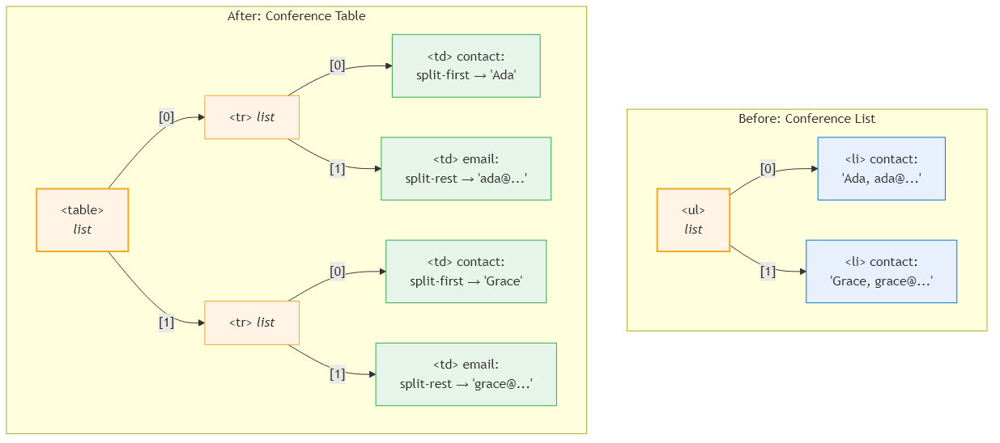

# Formative Examples {#chap:formative}

This chapter demonstrates the mydenicek system through six formative examples. Each example illustrates a different aspect of the system's capabilities and is backed by a passing test in the repository. The examples progress from simple operations to complex concurrent structural transformations.

## Hello World: custom primitive edits and replay {#sec:hello-world}

The first example demonstrates two fundamental capabilities: *custom primitive edits* and *wildcard replay*.

We start with a list of messages with inconsistent capitalization. A custom primitive edit `capitalize` is registered that title-cases a string. The edit is applied to one message on a "recorded" peer, then the events are synced to a "replay" peer. The replay peer replays the same edit targeting `messages/*` --- the wildcard causes the capitalize transformation to be applied to every item in the list.

```typescript
// Register a custom primitive edit
registerPrimitiveEdit("capitalize", (value) => {
  if (typeof value !== "string") throw new Error("expects string");
  return value.toLowerCase().split(" ")
    .map(w => w[0].toUpperCase() + w.slice(1)).join(" ");
});

// Apply to one message, sync, then replay on all
const eventId = recordedPeer.applyPrimitiveEdit(
  "messages/0", "capitalize");
sync(recordedPeer, replayPeer);
replayPeer.replayEditFromEventId(eventId, "messages/*");
// Result: all messages title-cased
```

This example shows that the CRDT is extensible --- users can register domain-specific transformations that participate in the event DAG and can be replayed like any other edit.

## Counter: formulas and programming by demonstration {#sec:counter}

The counter example demonstrates the *formula engine* and *recording/replay* (programming by demonstration).

The document starts with a simple `counter/value = 0`. We record three edits that implement "increment":

```typescript
const wrapId = dk.wrapRecord(
  "counter/value", "value", "x-formula-plus");
const renameId = dk.rename(
  "counter/value", "value", "left");
const addRightId = dk.add(
  "counter/value", "right", 1);

// Store event IDs as replay steps
dk.pushBack("counter/btn/steps",
  { $tag: "step", eventId: wrapId });
dk.pushBack("counter/btn/steps",
  { $tag: "step", eventId: renameId });
dk.pushBack("counter/btn/steps",
  { $tag: "step", eventId: addRightId });
```

These three event IDs are stored as replay steps in a button node. Each time the button is "clicked" (the steps are replayed), a new `x-formula-plus` layer wraps the previous result:

```
0 -> { $tag: "x-formula-plus",
       left: 0, right: 1 }           = 1
  -> { $tag: "x-formula-plus",
       left: { $tag: "x-formula-plus",
               left: 0, right: 1 },
       right: 1 }                     = 2
```

The formula engine evaluates the nested structure recursively, computing `((0+1)+1) = 2`. This pattern works for any operation --- multiplication, concatenation, or custom formulas.

## Conference List: adding items with recorded edits {#sec:conf-list}

The conference list demonstrates how recorded edits work with an input field and a button to add items to a list.

The document contains a list of speakers (each with a `"Name, email"` string), an input field, and an "Add" button. We record two edits:

```typescript
// Record the "add speaker" recipe
const pushId = dk.pushFront("conferenceList/items",
  { $tag: "li", text: "" });
const copyId = dk.copy("conferenceList/items/!0/text",
  "conferenceList/composer/input/value");

// Store as replay steps in the button
dk.pushBack("conferenceList/composer/addAction/steps",
  { $tag: "step", eventId: pushId });
dk.pushBack("conferenceList/composer/addAction/steps",
  { $tag: "step", eventId: copyId });
```

The `!0` strict index is crucial: it refers to the item at position 0 *at the time of recording*. During replay, OT transforms this index if concurrent insertions have shifted it.

When the button is replayed, it creates a new item and fills it with whatever text is currently in the input field. Two peers can concurrently add speakers --- after sync, both items appear in the list.

## Conference Table: structural transformation {#sec:conf-table}

The conference table example is the most complex formative example. It demonstrates *schema evolution* --- refactoring a flat list into a structured table using only the edit operations available in the CRDT. [@Fig:conf-table-transform] shows the document tree before and after the transformation.

{#fig:conf-table-transform width=95%}

Starting from the conference list (a `<ul>` with `<li>` items containing `"Name, email"` strings), Alice performs the following structural transformation:

```typescript
// 1. Change tags: ul -> table, li -> td
alice.updateTag("speakers", "table");
alice.updateTag("speakers/*", "td");

// 2. Wrap each <td> in a <tr> list
alice.wrapList("speakers/*", "tr");

// 3. Wrap contact in split-first formula
alice.wrapRecord(
  "speakers/*/0/contact", "source", "split-first");

// 4. Add email column with split-rest
alice.pushBack("speakers/*", {
  $tag: "td",
  email: {
    $tag: "split-rest",
    source: { $ref: "../../0/contact/source" }
  }
});
```

After this transformation, each table row has two cells:

- **Name cell**: the `split-first` formula evaluates the original `"Ada Lovelace, ada@ex.com"` and returns `"Ada Lovelace"`
- **Email cell**: the `split-rest` formula references the same source string and returns `"ada@ex.com"`

The wildcard `*` in all four steps ensures that the transformation is applied to every row simultaneously. All edits are recorded as events in the DAG.

## Conference Table: concurrent editing {#sec:conf-concurrent}

This is the key demonstration of the system's convergence properties. Two peers start from the same conference list, disconnect, and make concurrent edits:

- **Alice** (offline) performs the structural transformation described above --- refactoring the list into a table with split-first/split-rest formula columns.
- **Bob** (offline) adds two new speakers to the list via `pushBack`.

When they reconnect and sync, the event DAG shows a *concurrent fork*: Alice's structural edits (5 events) and Bob's insertions (2 events) branch from the same parent event and merge at the frontier.

This example demonstrates the *wildcard-affects-concurrent-insertions* property described in [@Sec:wildcard-concurrent]: Alice's wildcard edits (`updateTag("speakers/*", ...)`, `wrapList("speakers/*", ...)`) expand at replay time to include Bob's concurrently inserted items. The result is that Bob's new speakers are automatically wrapped in `<tr>` lists and receive the split formula cells, even though they were inserted as plain `<li>` items into a `<ul>` list. This semantics is a direct consequence of the replay-based OT approach and is uncommon in traditional CRDTs.

The OT transformation rules handle this correctly:

- Bob's `pushBack` edits originally target a `<ul>` list and insert `<li>` items. After merging with Alice's events, the OT transforms them: `updateTag` changes the inserted items' tags, `wrapList` wraps them in `<tr>` lists, and `pushBack` adds the split formula cells.
- The result is a table containing all four speakers --- the original two from the initial document plus Bob's two concurrent additions --- each with correctly split name and email columns.

The event graph visualization in the web application shows this fork-and-merge pattern clearly: two branches of events with different peer colors converging at a merge point. [@Fig:concurrent-initial;@Fig:concurrent-alice;@Fig:concurrent-bob;@Fig:concurrent-merged] show the four stages of this process.

{#fig:concurrent-initial width=95%}

{#fig:concurrent-alice width=95%}

{#fig:concurrent-bob width=95%}

{#fig:concurrent-merged width=95%}

## Conference Budget: formulas with references {#sec:conf-budget}

The conference budget example demonstrates formulas that reference other nodes via `$ref` paths, combined with concurrent editing.

The document contains a table of speakers with fee columns. A `sum` formula references all fee cells via a wildcard path (`/speakers/*/fee`). When a new speaker is added concurrently by another peer, the wildcard reference automatically includes the new row --- the sum formula produces the correct total without any manual update.

This example validates that the formula engine correctly handles references that resolve to different sets of nodes as the document evolves through concurrent edits.
